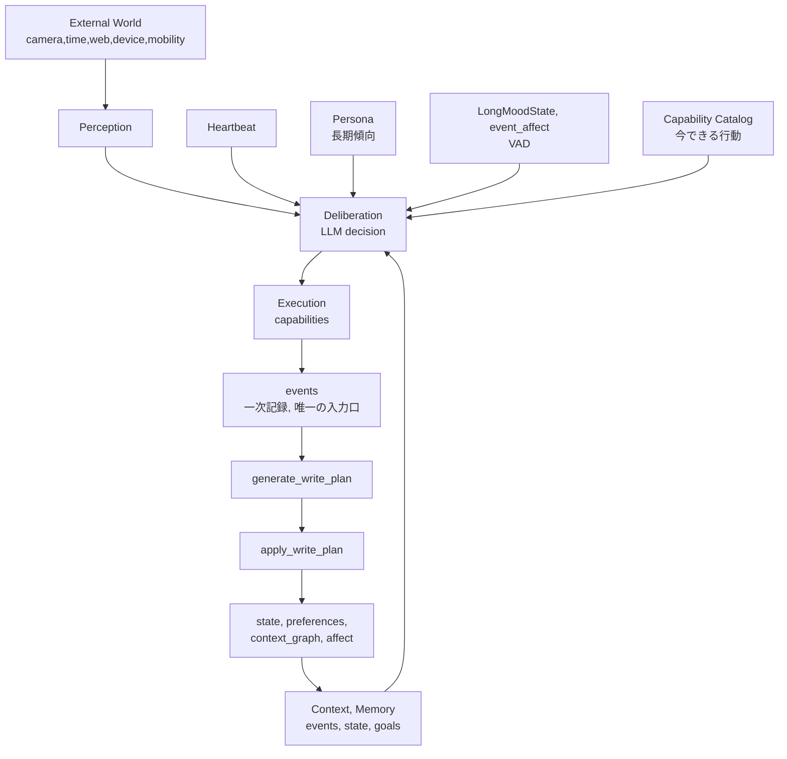
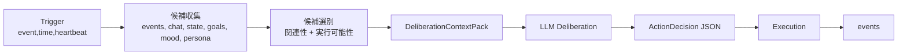
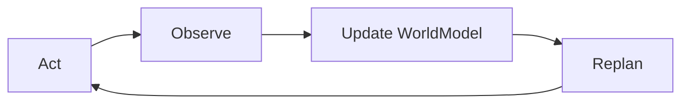

# 自発行動アーキテクチャ方針（概要）

<!-- Block: Position -->
この文書は、実装前の「基本方針」を固定するための概要設計。
詳細なテーブル定義・API仕様・ジョブ粒度は次段の詳細設計で確定する。
詳細設計は `docs/18_自発行動アーキテクチャ詳細設計.md` を正とする。

<!-- Block: Goal -->
## 目的

- 会話機能中心の現行構成から、**自発行動**を中核にした構成へ拡張する
- Webアクセスだけでなく、次を同じ設計原則で扱えるようにする
  - 常時カメラ観測
  - 思考に基づく移動
  - カメラ観測に基づく家電操作
  - 時刻条件に基づく操作（目覚まし/カーテン等）

<!-- Block: Conclusion -->
## 結論（先に固定する方針）

- `desktop_watch` を機能ごとに複製して増やす方式は採用しない
- `desktop_watch` は「能動視覚の1実装」として残し、上位を共通化する
- 共通アーキテクチャは `Perception / Deliberation / Execution / Scheduler` の4層とする
- 外界の事実入力と行動結果は `events` に追記し、`state` は非同期更新で育てる
- 思考ループは「イベント駆動を主、定期heartbeatを補助」とする
- 行動決定は **Persona + 気分（LongMoodState/event_affect/VAD）** を必須入力にする
- Web検索は「会話応答（`/api/chat`）」と「自発行動（Deliberation/Execution）」で経路を分離する

<!-- Block: Architecture Diagram -->
## 全体像（Mermaid）

<!-- Block: Deliberation Pipeline -->
## Deliberation入力の作り方（会話と同じ方針）

会話と同様に、Deliberationでも「広く集める -> 選別して注入」を採用する。

注記:

- `events` は全量をそのまま渡さない
- 選別後の `DeliberationContextPack` を注入する

<!-- Block: Web Search Split -->
## Web検索経路の分離（明示）

### 会話経路（既存）

- 対象: `/api/chat` の最終応答生成
- 目的: ユーザーとの会話本文を作る
- 特徴: 既存の `SYNC_CONVERSATION` 制約を維持する

### 自発行動経路（新規）

- 対象: Deliberation/Execution の「調査アクション」
- 目的: intent に基づく自律調査の実行
- 特徴: `/api/chat` を経由しない専用経路で実行する

### 分離ルール

- `/api/chat` から自発行動経路を呼ばない
- 自発行動から `/api/chat` を呼ばない
- どちらの経路でも「記憶検索（events/state）」にWeb検索結果を直接混在させない
- Web検索結果は行動結果として `events` に保存し、必要に応じて `state` へ昇格する

<!-- Block: Mood Persona Rules -->
## 気分（VAD）とペルソナの扱い

### 1) 役割分担

- `Persona`: 長期でほぼ不変の行動傾向・価値観
- `LongMoodState/event_affect`: 短中期で変動する行動バイアス（VAD）

### 2) Deliberationでの適用

- `V`（快・不快）: 接近/回避の傾向に効かせる
- `A`（覚醒）: 実行開始のしやすさ・即時性に効かせる
- `D`（主導）: 自律実行か確認優先かに効かせる

### 3) 必須出力

行動決定は構造化出力とし、最低限次を返す。

- `decision_outcome`（`do_action / skip / defer`）
- `action_type`
- `action_payload`
- `reason`
- `persona_influence`
- `mood_influence`
- `evidence_event_ids`

<!-- Block: Storage Responsibility -->
## 保持責務（どこに何を置くか）

### 1) 現在の状態（短期）

- 主: `RAM` の Runtime Blackboard
- 内容: 実行中タスク、注視対象、直近観測、現在の意図
- 補助: 再起動復元用に `runtime_snapshots`（永続）へ定期保存

### 2) 今まで行動したこと（履歴）

- 主: 既存の `memory_<embedding_preset_id>.db` の `events`
- 内容: 観測、行動、会話、外部入力、実行結果

### 3) 現在考えていること（短命思考）

- 主: `working_thought` / `deliberation_session`（短寿命）
- 内容: 仮説、候補行動、却下理由、次アクション
- 方針: 長期保持はせず、必要な要約のみ `state`/`goals` へ昇格

### 4) 中長期の状態

- 主: `state`（意味記憶）
- 追加: `goals` / `intents` / `plans`（継続目的と実行計画）

<!-- Block: Invariants -->
## 不変条件（設計上のルール）

- `state` への直接書き込みを禁止する
- 外界の事実入力と行動結果の正は `events` とする
- `events -> WritePlan -> state` の非同期パイプラインを崩さない
- Capabilityは「何ができるか」だけを持ち、意思決定を持たない
- 意思決定は Deliberation に集約する
- Deliberationは `Persona + Mood + Context` を必須入力にする

<!-- Block: World Cognition Principles -->
## 世界認識と自発行動の原則（詳細設計前の固定事項）

### WorldModel 最小要素

- 世界状態は最低限 `entity / relation / location / affordance / confidence / freshness` で表現する
- 事実を断定する場合は `confidence` と `freshness` を必須で持つ
- 1回の観測で確定できない情報は、確定状態へ昇格しない

### Observation の扱い

- Perception出力は「事実」「推定」「不明」を明示的に分ける
- 推定値は必ず確信度を持つ
- 不明は欠損として残し、推測で埋めない

### 行動の閉ループ

- 自発行動は `Act -> Observe -> Update -> Replan` を標準ループとする
- 行動後は必ず観測し、結果差分を更新する
- 期待と結果がズレた場合は再計画を優先する

### Intent のライフサイクル

- Intent は `proposed / queued / running / blocked / done / dropped` の状態を持つ
- `blocked` は外部条件待ちの状態として保持する
- `dropped` は破棄理由を必須で記録する

### ActionResult の分類

- 実行結果は `success / partial / failed / no_effect` を共通分類として使う
- `partial` と `no_effect` を `failed` と分離して記録する
- 再計画判定は結果分類を入力として使う

### 再計画トリガ

- 再計画は次をトリガに実行する
  - 新しい観測結果
  - 時刻経過（scheduler tick）
  - 行動失敗/部分成功
  - 気分変化（LongMoodState/event_affect）

### 検索ノイズ制御

- `source=deliberation_decision` は会話想起から常時除外する
- `action_result` も既定除外とし、有益情報のみ想起対象へ昇格する
- 内部判断文を会話検索へ混在させない

### 常時観測の非機能要件

- 常時観測ではレート制御を必須とする
- 同一内容の重複イベントは抑制する
- ジョブ滞留（pending/running）を監視し、閾値超過時は観測頻度を下げる

<!-- Block: Event Boundary -->
## events保存境界（重要）

- 保存する:
  - 外界から得た事実（観測結果）
  - 実行した行動とその結果（成功/失敗）
  - Deliberationの主要判断（ActionDecision要約）
- 保存しない:
  - 純粋な内部制御コマンド（例: `vision.capture_request` のような命令バス）
- 方針:
  - 「監査/再実行/失敗解析に必要な事実」は保存対象にする
  - 「一時的な内部制御」は非保存を許可する

<!-- Block: ActionDecision Persistence -->
## ActionDecision 保存ルール

ActionDecision は「判断した事実」として `events` に保存する。

### 1) 保存単位

- Deliberation 1回につき、ActionDecision イベントを1件保存する
- 実行した場合は、続けて ActionResult イベントを保存する（0件または複数件）

### 2) 保存先（events）

- `source` を分離して記録する
  - `deliberation_decision`
  - `action_result`
- `user_text` には検索用の短い要約を入れる
  - 例: `intent / action / reason / persona_influence / mood_influence`
- 構造化JSON（ActionDecision本体）は `client_context_json` ではなく専用保存領域へ入れる
  - 詳細設計で `events` 追加カラムまたは1:1補助テーブルとして定義する

### 3) searchable のルール

- `source=deliberation_decision` は常に `searchable=0` とする
- `source=action_result` は既定 `searchable=0` とする
- `source=action_result` でも、会話想起に有益な結果だけ `searchable=1` にする
- 会話検索側でも `source=deliberation_decision` は候補収集から除外する

### 4) state への反映

- ActionDecision は直接 `state` へ書き込まない
- `events -> WritePlan -> state` の経路で、必要なものだけ昇格する

### 5) 監査性

- ActionDecision には `evidence_event_ids` を必須で持たせる
- ActionResult は対応する decision を参照できるIDを持たせる

<!-- Block: Capability Policy -->
## Capability と Policy の分離

### Capability（能力）

- 例: `vision_perception`, `web_access`, `mobility_move`, `device_control`, `schedule_alarm`
- 役割: 実行インターフェースの提供（実行・結果・失敗理由）

### Policy / Service（運用戦略）

- 例: `desktop_watch`, `camera_watch`, `time_routine`
- 役割: いつ・どの条件でCapabilityを使うかを決める

注記:

- `desktop_watch` は Capability そのものではなく、`vision_perception` を利用する Policy 実装とみなす

<!-- Block: UiTerminology -->
### UI表記ルール（用語の見せ方）

- UIで「機能」と表記する対象は、原則として `Capability` を指す
- UIで `Policy` は「自動実行ルール」と表記する
- `desktop_watch` / `camera_watch` / `time_routine` は UI上の分類では「機能」ではなく「自動実行ルール」として扱う
- `desktop_watch` が利用する実行機能は `vision_perception`（例: `observe_screen`）である

<!-- Block: Rollout -->
## 実装ロードマップ（採用順）

差分視点ではなく、最初からこの順序で実装する。

### Phase 0: 基盤整備（必須）

1. Deliberation実行基盤を追加する
   - `LlmRequestPurpose` に Deliberation系 purpose を追加
   - ActionDecisionの構造化出力契約を固定
   - ActionDecision専用保存領域のスキーマを定義する（`client_context_json` には入れない）
2. `events` 保存境界を実装で固定する
   - 外界事実/行動結果は保存
   - 内部制御コマンドは非保存を許可
3. 既存Policyの責務を分離する
   - `desktop_watch` / `reminder` の意思決定をDeliberationへ移す
4. Schedulerの実行条件を自律化する
   - 時刻駆動行動の実行をUI接続有無から分離する
5. 負荷制御を入れる
   - イベント投入レート制御
   - 重複抑制
   - ジョブ滞留監視

完了条件:

- Deliberation経路で意思決定が一元化される
- `events` 保存境界がコードとドキュメントで一致する
- 時刻駆動行動がUI未接続でも実行可能になる
- 常時観測を想定したときにジョブ滞留が監視可能になる

### Phase 1: 自発Web調査（最初の縦切り）

1. Deliberation専用経路でWeb調査を実行できるようにする（`/api/chat` 非依存）
2. `intent生成 -> 調査実行 -> 結果保存 -> 自発メッセージ配信` を1本で通す
3. Deliberation入力に `Persona + Mood` を必須化する

完了条件:

- Web自発調査が1サイクル通る
- ActionDecisionに `persona_influence` / `mood_influence` が出る
- 調査結果が `events` と `state` に反映される

### Phase 2: 常時観測と行動拡張

1. `camera_watch` を `vision_perception` 上で実装する
2. `mobility_move` / `device_control` をCapabilityとして追加する
3. Runtime Blackboardの永続化（`runtime_snapshots`）を追加する

完了条件:

- 常時観測で得た事実がDeliberationへ流れ、行動に接続される
- 再起動後にRuntime状態の復元ができる

### Phase 3: 時刻駆動統合

1. `Scheduler` と `Execution` を一本化する
2. 時刻条件行動（目覚まし/カーテン等）を同じDeliberation経路に統合する

完了条件:

- 時刻駆動行動が他行動と同じ判断系で動作する
- 気分とペルソナの影響が時刻駆動行動にも適用される

<!-- Block: Current Hook -->
## 現行実装との接続点

- 定期実行基盤: `cocoro_ghost/runtime/periodic.py`
- 自発行動オーケストレーション: `cocoro_ghost/autonomy/orchestrator.py`, `cocoro_ghost/autonomy/repository.py`, `cocoro_ghost/autonomy/runtime_blackboard.py`
- Policy/Service 実装: `cocoro_ghost/desktop_watch.py`, `cocoro_ghost/camera_watch.py`, `cocoro_ghost/reminders/service.py`, `cocoro_ghost/autonomy/policies/`
- Capability 実装: `cocoro_ghost/autonomy/capabilities/`
- イベント配信: `cocoro_ghost/runtime/event_stream.py` (`/api/events/stream`)
- 記憶更新基盤: `cocoro_ghost/jobs/runner.py`, `cocoro_ghost/jobs/handlers/*.py`, `cocoro_ghost/jobs/handlers/autonomy.py`
- 記憶モデル: `cocoro_ghost/storage/memory_models.py` (`events`, `state`, `revisions`, ...)

<!-- Block: Out Of Scope -->
## この文書のスコープ外（詳細設計で確定）

- `goals/intents/plans/runtime_snapshots` の具体スキーマ
- Deliberation のプロンプト設計と評価指標
- CapabilityごとのAPI契約（引数/戻り値/失敗分類）
- 実行優先度、競合解決、再試行戦略
