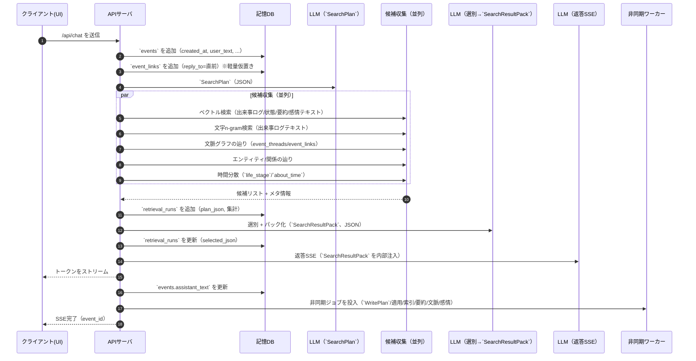

# 実行フロー（同期/非同期のつながり）

ここでは「入力→検索→SSE→記憶更新」がどう繋がるかを、順に示す。

## 全体の前提

- `/api/chat` は体感速度のため **SSE** を使う
- ストリーム開始前に「必要な記憶」を確定する（`SearchPlan`→候補→選別）
- 重い更新（`WritePlan`/状態更新/文脈グラフ本更新/埋め込み/要約）は **非同期**に回す

## 同期フロー（/api/chat）

目的:

- 返答の本文をできるだけ早くストリーム開始する
- そのために、ストリーム開始前に「思い出し（検索）」だけは終える

### シーケンス

### 同期で書き込むもの（最小）

- `events`: 作成（user_text 等）→ SSE完了後に `assistant_text` を更新
- `event_links`: `reply_to` の仮置き（同じ `client_id` の直前チャット `event_id`、LLMなし）
- `retrieval_runs`: `SearchPlan` と採用理由（デバッグ/観測用）

注記:

- 候補収集は並列で走らせる（遅い収集があっても全体が破綻しないようにタイムアウトを設ける）
- `SearchResultPack` は「検索結果だけ」で、現在文脈は混ぜない（混ぜるとデバッグが難しくなる）

## 非同期フロー（記憶を育てる）

目的:

- 忘れないログ（`events`）から、検索に効く「状態」「要約」「文脈」「感情」を育てる
- 同期の体感を壊さずに品質を上げる

### ジョブの流れ（推奨）

1. `generate_write_plan(event_id)`
   - `about_time` 推定（年/日レンジ + `life_stage`）
   - エンティティ抽出
   - state_updates（fact/relation/task/summary/long_mood_state）
   - event_affect（瞬間的な感情）
   - context_updates（文脈スレッド/リンクの本更新案）
2. `apply_write_plan(event_id)`
   - `events` の注釈更新（`about_time`/`entities` 等）
   - 状態を更新/追加（`upsert`）（並存/期間分割/`last_confirmed_at`）
   - 改訂履歴（`revisions`）追記（根拠イベント必須）
   - `event_affect` 保存
   - `long_mood_state` 更新 + `revisions`
   - 文脈グラフ本更新（event_threads/event_links）+ `revisions`
3. `refresh_indexes(changed_items)`
   - ベクトル索引更新（出来事ログ/状態/要約/感情テキスト）
   - 文字n-gram索引更新（出来事ログテキスト）
4. `refresh_summaries(scopes)`
   - 人物/話題/期間/スレッド要約など

### 視覚イベントの扱い（要点）

- `vision.capture_request` は命令なので出来事ログに残さない（`/api/events/stream` の `event_id: 0`）
- `vision.capture_response` で受け取った画像は保存せず、LLMで **詳細な画像説明**を生成して出来事ログ（`events`）に追記する

### 非同期が次ターンに効くポイント

 - 状態が更新されることで「同じ質問でもより短く正確に」思い出せる
 - 文脈グラフが育つことで「なんの話の流れだっけ？」が辿りやすくなる
 - `long_mood_state` が育つことで「最近の空気感」が返答に滲む

## 時系列のイメージ（超要約）

- t0: `events` 作成（user_text）
- t1: `SearchPlan`
- t2: 候補収集（並列）
- t3: 選別 → `SearchResultPack`
- t4: SSE開始（ユーザー体感はここから）
- t5: SSE完了 → `events.assistant_text` 更新
- t6: 非同期で記憶更新（次ターン以降に効く）
