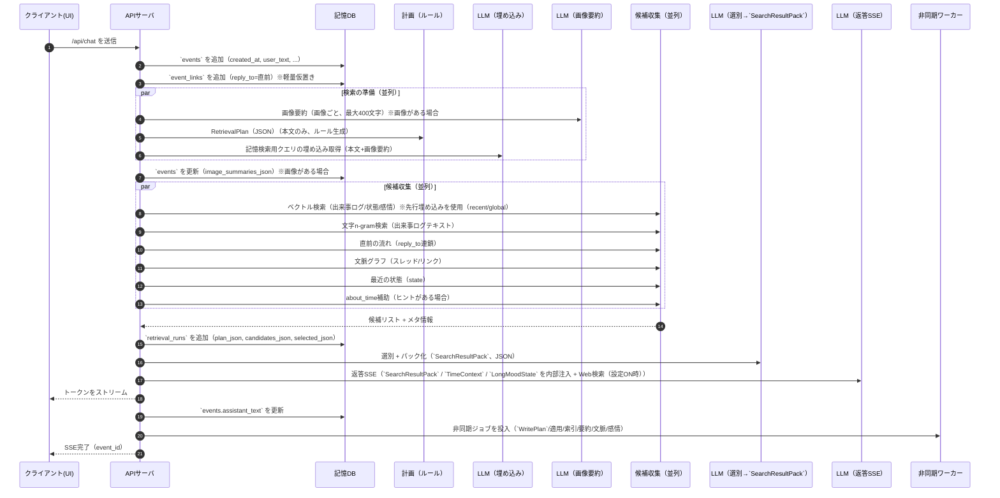
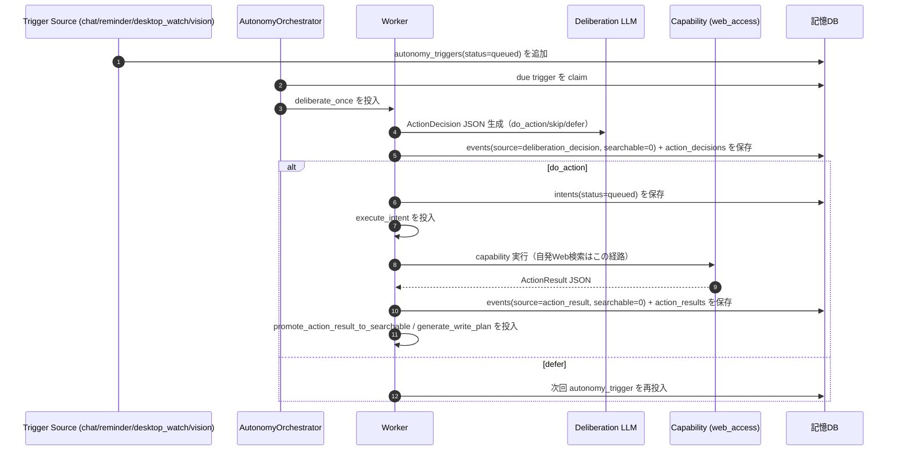

# 実行フロー（同期/非同期のつながり）

ここでは「入力→検索→SSE→記憶更新」がどう繋がるかを、順に示す。

## 全体の前提

- `/api/chat` は体感速度のため **SSE** を使う
- ストリーム開始前に「必要な記憶」を確定する（RetrievalPlan→候補→選別）
- **Web検索（インターネット検索）の現行実装は、最終応答生成（L3）でのみ有効化可能（LLMプリセット設定ON時）**
- 自発行動向けのWeb検索は `/api/chat` と別経路（autonomy worker経路）で実行する（`docs/03_自発行動アーキテクチャ方針.md` / `docs/18_自発行動アーキテクチャ詳細設計.md`）
- 重い更新（`WritePlan`/状態更新/文脈グラフ本更新/埋め込み/要約）は **非同期**に回す

## 同期フロー（/api/chat）

目的:

- 返答の本文をできるだけ早くストリーム開始する
- そのために、ストリーム開始前に「思い出し（検索）」だけは終える

### シーケンス



### 同期で書き込むもの（最小）

- `events`: 作成（user_text 等）→ SSE完了後に `assistant_text` を更新
- `events.image_summaries_json`: 画像付きチャットの場合のみ保存（画像要約、内部用、本文に出力しない）
- `event_links`: `reply_to` の仮置き（同じ `client_id` の直前チャット `event_id`、LLMなし）
- `retrieval_runs`: RetrievalPlan（ルール生成）と採用理由（デバッグ/観測用）

注記:

- 候補収集は並列で走らせる（遅い収集があっても全体が破綻しないようにタイムアウトを設ける）
- `SearchResultPack` は「検索結果だけ」で、現在文脈は混ぜない（混ぜるとデバッグが難しくなる）
- 返答生成には `TimeContext`（now/last_chat_created_at/gap_text）を内部注入し、会話の中断（時間経過）を自然に認識できるようにする
  - `now` は domain時刻（`/api/control/time/advance` で前進可能）を使う
- 返答生成には `LongMoodState`（背景の長期感情）も内部注入し、トーンに反映する（本文に内部JSONやVAD数値を出さない）
- 返答生成には `ConfirmedPreferences`（確定した好み/苦手）も内部注入し、「好き/苦手」の断定の根拠に限定して使う（推測で断定しない）
- 画像付きチャットの場合、返答生成には `ImageSummaries`（画像要約）も内部注入する（本文に出力しない）
- 返答の本文はユーザーに向けた会話の発話（セリフ）として書き、内心は `event_affect` として保持する
- 体感速度とキャッシュ効率のため、返答生成では **固定ヘッダ（不変メッセージ）**を先頭に置き、可変な `INTERNAL_CONTEXT` は末尾に寄せる
- Web検索（インターネット）の現行実装は **会話応答作成（L3）だけ** で有効化する（記憶検索経路には混ぜない）
- 自発行動向けWeb検索は `/api/chat` と分離した専用経路（`execute_intent` -> `web_access`）で実行する（L3経路へ混ぜない）
- Web検索のON/OFFは `llm_preset.reply_web_search_enabled` で制御する

### `TimeContext` の構造

```json
{
  "TimeContext": {
    "now": "2026-01-10T14:06:59",
    "last_chat_created_at": "2026-01-10T13:50:00",
    "gap_text": "さっき"
  }
}
```

| キー | 説明 |
|-----|------|
| now | 現在時刻（ISO 8601、ローカル時刻、タイムゾーン表記なし） |
| last_chat_created_at | 同じclient_idの直前チャットの時刻（無ければnull） |
| gap_text | 前回からの経過を短い日本語にした文字列（例: さっき/数分前/昨日） |

### `LongMoodState` の構造

```json
{
  "LongMoodState": {
    "state_id": 1,
    "kind": "long_mood_state",
    "body_text": "string",
    "payload": {},
    "vad": {"v": 0.0, "a": 0.0, "d": 0.0},
    "baseline_vad": {"v": 0.0, "a": 0.0, "d": 0.0},
    "shock_vad": {"v": 0.0, "a": 0.0, "d": 0.0},
    "confidence": 0.0,
    "last_confirmed_at": "2026-01-10T14:06:59",
    "valid_from_ts": null,
    "valid_to_ts": null
  }
}
```

注記:

- `LongMoodState` は「現在の背景気分」なので、`SearchResultPack`（検索結果）とは分けて注入する
- `LongMoodState` が存在しない場合は null になる

## 自発行動フロー（/api/chat と分離）

目的:

- 会話経路を遅くせず、イベント起点で自律的に意思決定と行動実行を進める
- 自発Web検索を会話L3と混在させない

### シーケンス（要約）



### 不変条件

- `/api/chat` のWeb検索と自発Web検索は経路分離する（別 purpose / 別呼び出し）
- `events.source='deliberation_decision'` は会話想起検索から除外する
- `action_result` は Worker で `recall_decision` を最終確定し、採用時のみ `events.searchable=1` に昇格する

## 非同期フロー（記憶を育てる）

目的:

- 忘れないログ（`events`）から、検索に効く「状態」「要約」「文脈」「感情」を育てる
- 同期の体感を壊さずに品質を上げる

### ジョブの流れ（現行）

1. `upsert_event_embedding(event_id)`
   - events の埋め込みを更新（次ターンのvec候補に効く）
2. `upsert_event_assistant_summary(event_id)`
   - events.assistant_text の要約を作成（選別入力の高速化）
3. `generate_write_plan(event_id)`
   - `about_time` 推定（年/日レンジ + `life_stage`）
   - エンティティ抽出
   - state_updates（fact/relation/task/summary/long_mood_state）
   - state_updates.entities（state単位のentity付与）
   - event_affect（瞬間的な感情）
   - context_updates（文脈スレッド/リンクの本更新案）
4. `apply_write_plan(event_id)`
   - `events` の注釈更新（`about_time`/`entities` 等）
   - 状態を更新/追加（`upsert`）（並存/期間分割/`last_confirmed_at`）
   - `state_entities` の更新（state_updates.entities を正にする）
   - 改訂履歴（`revisions`）追記（根拠イベント必須）
   - `event_affect` 保存 + `upsert_event_affect_embedding`
   - `long_mood_state` 更新 + `revisions`（背景注入用）
   - 文脈グラフ本更新（event_threads/event_links）+ `revisions`
   - `upsert_state_embedding`（更新されたstateごと）
   - `build_state_links`（更新されたstateを起点に state_links を生成）
5. `tidy_memory()`（chat Nターンごと）
   - 状態（`state`）の過去化（完全一致の重複のみ）

注記:

- `tidy_memory()` は品質最優先のため WORKER で実行し、/api/chat の同期経路には入れない
- 詳細は `docs/05_記憶更新（育てる）.md` の「記憶整理（tidy_memory）」を参照

### 視覚イベントの扱い（要点）

- `vision.capture_request` は命令なので出来事ログに残さない（`/api/events/stream` の `event_id: 0`）
- `vision.capture_response` で受け取った画像は保存せず、LLMで **詳細な画像説明**を生成して出来事ログ（`events`）に追記する

### 非同期が次ターンに効くポイント

 - 状態が更新されることで「同じ質問でもより短く正確に」思い出せる
 - 文脈グラフが育つことで「なんの話の流れだっけ？」が辿りやすくなる
 - `long_mood_state` が育つことで「最近の空気感」が返答に滲む

## 時系列のイメージ（超要約）

- t0: `events` 作成（user_text）
- t1: RetrievalPlan（ルール）
- t2: 候補収集（並列）
- t3: 選別 → `SearchResultPack`
- t4: SSE開始（ユーザー体感はここから）
- t5: SSE完了 → `events.assistant_text` 更新
- t6: 非同期で記憶更新（次ターン以降に効く）

## 観測とデバッグ（まず見るべきポイント）

品質最優先のため、「なぜその記憶を選んだか」を追えるようにする。

残したいログ（要点）:

- 検索計画（RetrievalPlan、短いJSON。ルール生成）
- 候補収集の統計（件数、ソース別内訳）
- entity展開（`entity_expand`）の観測（選んだentity、追加候補数、適用した閾値）
- stateリンク展開（`state_link_expand`）の観測（seed state、追加候補数、適用した閾値）
- 採用結果（選んだもの、理由）
- 非同期の state_links 生成（`build_state_links`）の観測（生成件数、採用したconfidence/距離の足切り）

失敗時の扱い（重要）:

- `build_state_links` / `tidy_memory` を含む worker ジョブは retry し、上限到達時は `jobs.status=3`（dead-letter）へ移る
- workerジョブの再試行上限は現行 `2回`（`JOB_MAX_RETRIES=2`）
- `build_state_links` の LLM呼び出しは現行 `max_tokens=800` で実行する
- `build_state_links` は LLM応答が `finish_reason=length` で切れてJSONを読めないとき、`max_tokens` 増加を促すエラーログを出す
- `build_state_links` が dead-letter に偏ると `state_links` が増えず、同期検索の `state_link_expand` は `added_state_count=0` になりやすい
- 原因切り分けは `jobs.last_error` を一次情報にする（実装不備か、外部LLM接続失敗かを分離できる）

体感速度の観測（SSE開始前）:

- 埋め込み（検索クエリ）: `LLM response 受信 【同期】＜＜ 記憶検索用クエリの埋め込み取得 ＞＞ ... ms=<N>`
- 選別入力サイズ: `SearchResultPack selection input prepared candidates=<N> chars=<M>`
- SearchResultPack 選別: `LLM response 受信 【同期】＜＜ 検索候補の選別（SearchResultPack） ＞＞ ... ms=<N>`
- 会話応答作成（SSE本文）: `LLM response 受信 【同期】＜＜ 会話応答作成 ＞＞ ... ms=<N>`
