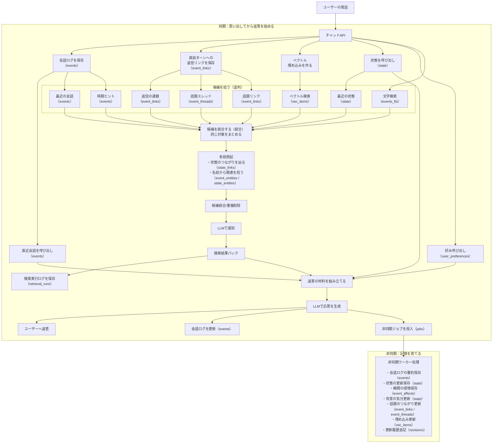

# システムフロー図（簡易版）

「ユーザー入力 → 思い出す（同期） → 返答（ストリーム） → 育てる（非同期）」の流れを整理する。

- 同期は「ストリーム開始まで」を最優先にして、**思い出し（候補収集→選別）だけ**を先に終える
- 非同期は、要約・状態・感情・文脈・索引を更新して、**次ターン以降**の品質を育てる
- 図では「どのSQLiteテーブルを触るか」を、処理名のカッコ内に書く（DBの枠は省略する）

## 候補はどうやって集める？

結論: **1つの検索だけに頼らず**、SQLiteの出来事ログ・状態・索引から「取りこぼし防止」を優先して広く集め、最後に大規模言語モデルで絞る。

### 1) まず広く集める（同期・並列）

返答を始める前に、次の経路を（可能な範囲で）並列に走らせて候補を集める。

- **現行の収集経路（実装）**
  - 会話ログから最近を拾う（eventsテーブル）
  - 文字検索で拾う（events_ftsテーブル）
  - 返信のつながりを辿って拾う（event_linksテーブル）
  - 話題リンクを辿って拾う（event_linksテーブル）
  - 話題スレッドを辿って拾う（event_threadsテーブル）
  - 最近の状態を拾う（stateテーブル）
  - 年や時期のヒントで拾う（eventsテーブル）
  - ベクトル検索で拾う（vec_itemsテーブル）
  - 補足: 遅い経路があっても全体が止まらないよう、経路ごとに短いタイムアウトを置く

- **ベクトル検索で候補を集める（vec_itemsテーブル）**
  - ユーザー入力から **ベクトル埋め込み**を作り、似ている出来事・状態・感情を拾う
  - 取りこぼし防止のため、「最近寄り」と「全期間から少量（ひらめき枠）」を混ぜる
  - 実体は eventsテーブル / stateテーブル / event_affectsテーブル にある（vec_itemsテーブルは索引）
- **文字検索で候補を集める（events_ftsテーブル）**
  - 固有名詞や型番など「表記の一致」を拾うために使う
  - 実体は eventsテーブル にある（events_ftsテーブルは索引）
- **返信のつながりで候補を集める（event_linksテーブル）**
  - 直前の流れ（reply_to）を辿って、会話の連続性を保つ
- **話題のつながりで候補を集める（event_links / event_threadsテーブル）**
  - 話題リンク（same_topic / caused_by / continuation）と、話題スレッド（thread_key）を辿って拾う
- **最近の状態で候補を集める（stateテーブル）**
  - 事実やタスクなど、会話の安定に効く「育った情報」を少量入れる
- **時間ヒントで候補を集める（eventsテーブル）**
  - 入力に年や学生区分などの明示ヒントがある場合だけ、対象範囲を絞って拾う

### 2) 少しだけ広げる（多段の想起）

最初に集まった候補を「種」にして、候補を少しだけ追加する（やりすぎるとノイズが増えるため、上限を強めに固定する）。

- **名前（エンティティ）から広げる**
  - 候補に付いている「人・組織・場所・プロジェクト等」の名前を手がかりに、関連する出来事や状態を追加で拾う
  - 参照: `event_entities` / `state_entities`
- **状態どうしのつながりから広げる**
  - 状態のリンクを1回だけ辿り、関連する状態を追加で拾う
  - 参照: `state_links`

### 3) 統合して、入力サイズを守る

候補が増えすぎると、選別（大規模言語モデル）入力が肥大化して体感速度が落ちる。
そのため統合時に次を必ず行う。

- **重複を落とす**（同じ対象を二重に入れない）
- **上限を守る**（候補の最大数を超えない）
- **偏りを抑える**
  - 増えやすい経路（文字検索や文脈など）が席を独占しないよう、枠を配分する
  - 瞬間の感情は候補を食い過ぎやすいので、割合の上限だけを設ける

### 4) 最後に大規模言語モデルで選び抜く

候補は「短いプレビュー＋メタ情報」だけに圧縮して大規模言語モデルへ渡し、
必要なものだけを選んだ検索結果パックを作る（その後の返答生成の材料になる）。

補足:

- より詳細な説明は `docs/04_検索（思い出す）.md` を参照。
