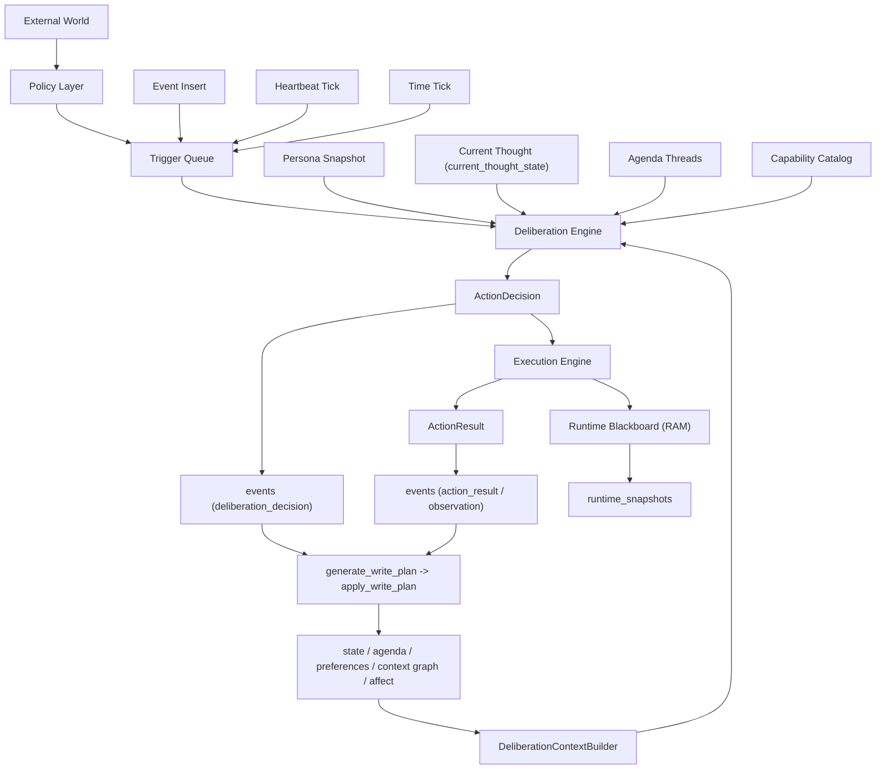
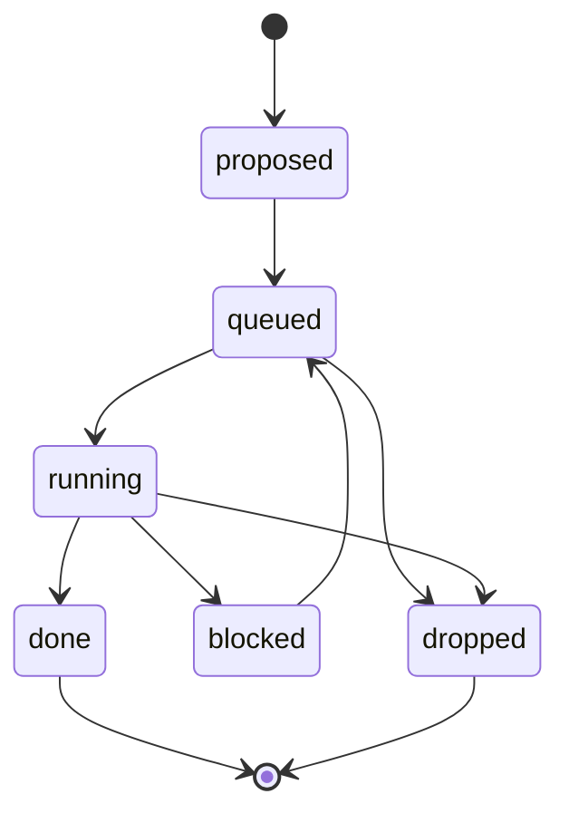
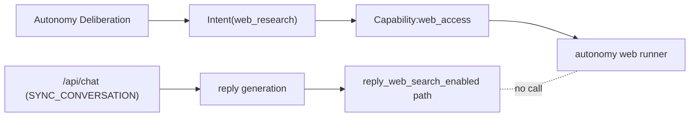

# 自発行動アーキテクチャ詳細設計（`docs/03` 実装）

<!-- Block: Position -->
## 位置づけ

- 本書は `docs/03_自発行動アーキテクチャ方針.md` を実装可能な粒度へ落とす詳細設計である
- 本書を「設計の正」とし、実装順序も本書内で固定する
- 対象は単一ユーザー運用のみとし、多ユーザー対応は扱わない

<!-- Block: Goals -->
## 目的

- 自発行動を `Perception / Deliberation / Execution / Scheduler` の4層で実装する
- `/api/chat` の会話経路と、自発行動（特にWeb調査）経路を完全分離する
- `events -> WritePlan -> state` の一方向パイプラインを維持したまま、観測・判断・行動を拡張する
- Persona と `current_thought_state` / `agenda_threads` を自発行動の主入力として実行時に効かせる

<!-- Block: NonGoals -->
## 非対象

- デバイス固有プロトコル（家電メーカーごとの差分）の最終仕様
- 多人数セッション制御
- 後方互換維持のための暫定経路

<!-- Block: FixedInvariants -->
## 固定不変条件

- `state` へ直接書き込まない（必ず `events -> WritePlan -> state`）
- Capability は実行のみ、意思決定は Deliberation のみ
- `source=deliberation_decision` は常に `searchable=0`
- `source=action_result` は既定 `searchable=0`、有益情報のみ `1`
- `intents.status=dropped` の行は `dropped_reason` を必須で持つ
- `/api/chat` から自発Web経路を呼ばない
- 自発Web経路から `/api/chat` を呼ばない
- `vision.capture_request` など純粋な内部制御コマンドは `events` 非保存を許可する

<!-- Block: RuntimeOverview -->
## 実行時全体像



<!-- Block: LayerResponsibilities -->
## レイヤ責務

### 1) Policy Layer

- 役割は「いつ観測/検討を起動するか」の判定だけ
- 具体例:
  - `desktop_watch_policy`: 画面観測タイミングをトリガ化
  - `time_routine_policy`: 時刻条件をトリガ化
  - `camera_watch_policy`: 常時カメラ監視の間隔制御
- 禁止事項:
  - LLM呼び出し
  - 行動実行
  - `state` 更新

### 2) Deliberation Engine

- 入力: Trigger + ContextPack + Persona + CurrentThought + AgendaThreads + CapabilityCatalog
- 出力: ActionDecision（構造化JSON）
- 責務:
  - `do_action / skip / defer` の決定
  - 実行理由と証拠の明示
  - Persona影響と thread 選定根拠の明示
  - `defer` の場合は再検討時刻を必ず返す

### 3) Execution Engine

- 入力: ActionDecision から生成された Intent
- 出力: ActionResult（構造化JSON）
- 責務:
  - Capability の選択と実行
  - 結果の分類（`success / partial / failed / no_effect`）
  - 行動後観測（`Act -> Observe`）の起点生成

### 4) Scheduler

- 主はイベント駆動、補助として `time` / `policy` / `heartbeat`
- 役割:
  - Triggerキュー管理
  - Intent実行順序管理
  - due な agenda の再検討
  - `defer` 再投入の管理

<!-- Block: NewModules -->
## モジュール設計（新規）

- `cocoro_ghost/autonomy/orchestrator.py`
  - 自発行動の総合エントリポイント
- `cocoro_ghost/autonomy/policies/*.py`
  - Policy実装（desktop_watch/time_routine/camera_watch）
- `cocoro_ghost/autonomy/context_builder.py`
  - DeliberationContextPack 構築
- `cocoro_ghost/autonomy/deliberation.py`
  - LLM意思決定実装
- `cocoro_ghost/autonomy/executor.py`
  - Intent実行管理
- `cocoro_ghost/autonomy/capabilities/*.py`
  - Capability実装（`vision_perception`, `web_access`, `mobility_move`, `device_control`, `schedule_alarm`）
- `cocoro_ghost/autonomy/runtime_blackboard.py`
  - RAM状態管理と snapshot I/O
- `cocoro_ghost/autonomy/repository.py`
  - autonomy専用テーブルアクセス

<!-- Block: ExistingModuleRefactor -->
## 既存モジュールの再責務化

- `cocoro_ghost/memory/_external_mixin.py`
  - `run_reminder_once` は reminder event の保存/配信責務に限定する（autonomy trigger 投入は `reminders/service.py` 側）
  - `run_desktop_watch_once` は legacy 実行ヘルパとして維持し、`vision_perception` capability から呼ぶ
- `cocoro_ghost/vision/desktop_watch.py`
  - 直接実行から、`desktop_watch_policy` の tick 呼び出しへ変更
- `cocoro_ghost/reminders/service.py`
  - `event_stream.has_any_client_connected()` 依存を削除
  - 時刻到達をトリガ化する責務へ変更
- `cocoro_ghost/llm/client.py`
  - Deliberation purpose と自発Web action purpose を追加
  - `/api/chat` 用Web設定ロジックと分離

<!-- Block: DataModel -->
## データモデル詳細（memory DB）

### 追加テーブル一覧

| テーブル | 用途 |
|---|---|
| `action_decisions` | Deliberation判断の本体JSON保存（`events` 1:1） |
| `intents` | 実行キュー・状態遷移管理 |
| `action_results` | 実行結果の本体JSON保存（`events` 1:1） |
| `agenda_threads` | `current_thought_state` の実体となる継続タスク管理 |
| `world_model_items` | 世界状態の構造化保持（entity/relation/location/affordance/confidence/freshness） |
| `goals` | 中長期目標の管理 |
| `runtime_snapshots` | Runtime Blackboard の再起動復元 |
| `autonomy_triggers` | イベント駆動/時刻駆動のトリガ管理 |

### `action_decisions`

| カラム | 型 | 説明 |
|---|---|---|
| `decision_id` | TEXT PK | UUID |
| `event_id` | INTEGER UNIQUE FK | `events.event_id`（`source=deliberation_decision`） |
| `trigger_type` | TEXT | `event/time/heartbeat/policy` |
| `trigger_ref` | TEXT | event_idやpolicy名 |
| `agenda_thread_id` | TEXT NULL | 実行対象として選ばれた agenda thread |
| `decision_outcome` | TEXT NOT NULL | `do_action/skip/defer` |
| `action_type` | TEXT | `web_research` など |
| `action_payload_json` | TEXT | 実行入力 |
| `reason_text` | TEXT | 判断理由 |
| `defer_reason` | TEXT NULL | `defer` 理由 |
| `defer_until` | INTEGER NULL | defer解除予定（domain UTC秒） |
| `next_deliberation_at` | INTEGER NULL | 次回Deliberation予定（domain UTC秒） |
| `persona_influence_json` | TEXT | 影響要約 |
| `mood_influence_json` | TEXT | 互換保持用の監査値（自発判断には使わない） |
| `console_delivery_json` | TEXT | 進行中表示用メタデータ |
| `evidence_event_ids_json` | TEXT | 根拠イベント |
| `evidence_state_ids_json` | TEXT | 根拠状態 |
| `evidence_goal_ids_json` | TEXT | 根拠ゴール |
| `confidence` | REAL | 判断確信度 |
| `created_at` | INTEGER | UTC UNIX秒 |

補足:

- `agenda_thread_id` は `ActionResult` から exact な thread を更新するための正本リンク
- `console_delivery_json` は進行中表示用であり、完了時の `silent/notify/chat` は `action_result -> report_candidate` から決める

DB制約（必須）:

- `CHECK (decision_outcome IN ('do_action','skip','defer'))`
- `CHECK (decision_outcome <> 'defer' OR length(trim(COALESCE(defer_reason,''))) > 0)`
- `CHECK (decision_outcome <> 'defer' OR defer_until IS NOT NULL)`
- `CHECK (decision_outcome <> 'defer' OR next_deliberation_at IS NOT NULL)`
- `CHECK (decision_outcome <> 'defer' OR next_deliberation_at >= defer_until)`
- `CHECK (decision_outcome <> 'do_action' OR length(trim(COALESCE(action_type,''))) > 0)`
- `CHECK (decision_outcome <> 'do_action' OR length(trim(COALESCE(action_payload_json,''))) > 0)`

### `intents`

| カラム | 型 | 説明 |
|---|---|---|
| `intent_id` | TEXT PK | UUID |
| `decision_id` | TEXT NOT NULL FK | `action_decisions.decision_id` |
| `goal_id` | TEXT FK NULL | `goals.goal_id` |
| `action_type` | TEXT NOT NULL | 実行種別 |
| `action_payload_json` | TEXT NOT NULL | 実行入力 |
| `status` | TEXT NOT NULL | `proposed/queued/running/blocked/done/dropped` |
| `priority` | INTEGER | 0-100 |
| `scheduled_at` | INTEGER | 実行予定（domain UTC秒） |
| `blocked_reason` | TEXT NULL | `blocked` 理由 |
| `dropped_reason` | TEXT NOT NULL DEFAULT `""` | `dropped` 理由（必須） |
| `dropped_at` | INTEGER NULL | `dropped` になった時刻（domain UTC秒） |
| `last_result_status` | TEXT NULL | 直近結果分類 |
| `created_at` | INTEGER | UTC UNIX秒 |
| `updated_at` | INTEGER | UTC UNIX秒 |

DB制約（必須）:

- `CHECK (status IN ('proposed','queued','running','blocked','done','dropped'))`
- `CHECK (status <> 'dropped' OR length(trim(dropped_reason)) > 0)`
- `CHECK (status <> 'dropped' OR dropped_at IS NOT NULL)`
- `CHECK (length(trim(action_type)) > 0)`
- `CHECK (length(trim(action_payload_json)) > 0)`
- `UNIQUE (decision_id)`（1 ActionDecision から Intent は常に1件）

Intent 生成規約（必須）:

- `decision_outcome='do_action'` の ActionDecision から Intent を作る時は、`decision_id` をキーに冪等生成する
- 生成SQLは次を正とする  
  - `INSERT INTO intents (...) VALUES (...) ON CONFLICT(decision_id) DO NOTHING`
- `DO NOTHING` の場合は既存 Intent を読み出して継続し、新規 Intent を再生成しない

### `action_results`

| カラム | 型 | 説明 |
|---|---|---|
| `result_id` | TEXT PK | UUID |
| `event_id` | INTEGER UNIQUE FK | `events.event_id`（`source=action_result`） |
| `intent_id` | TEXT FK | `intents.intent_id` |
| `decision_id` | TEXT FK | `action_decisions.decision_id` |
| `capability_name` | TEXT | 実行Capability |
| `result_status` | TEXT NOT NULL | `success/partial/failed/no_effect` |
| `result_payload_json` | TEXT | 実行結果本体 |
| `summary_text` | TEXT | 検索/通知用要約 |
| `useful_for_recall_hint` | INTEGER NOT NULL DEFAULT `0` | Execution が付与する昇格ヒント（0/1） |
| `recall_decision` | INTEGER NOT NULL DEFAULT `-1` | Worker 最終判定（-1=未判定,0=不採用,1=採用） |
| `recall_decided_at` | INTEGER NULL | 最終判定時刻（system UTC秒） |
| `created_at` | INTEGER | UTC UNIX秒 |

DB制約（必須）:

- `CHECK (useful_for_recall_hint IN (0,1))`
- `CHECK (result_status IN ('success','partial','failed','no_effect'))`
- `CHECK (recall_decision IN (-1,0,1))`
- `CHECK (recall_decision = -1 OR recall_decided_at IS NOT NULL)`

### `agenda_threads`

| カラム | 型 | 説明 |
|---|---|---|
| `thread_id` | TEXT PK | UUID |
| `thread_key` | TEXT UNIQUE | 話題単位の統合キー |
| `source_event_id` | INTEGER FK NULL | 起点 event |
| `source_result_id` | TEXT FK NULL | 起点 action_result |
| `kind` | TEXT NOT NULL | `research/observation/followup/reminder/support` |
| `topic` | TEXT NOT NULL | 人間向けの話題名 |
| `goal` | TEXT NULL | 補助ゴール文 |
| `status` | TEXT NOT NULL | `open/active/blocked/satisfied/stale/closed` |
| `priority` | INTEGER | thread 優先度 |
| `next_action_type` | TEXT NULL | 次の一手 |
| `next_action_payload_json` | TEXT | 次の一手の入力 |
| `followup_due_at` | INTEGER NULL | heartbeat 再検討時刻（domain UTC秒） |
| `last_progress_at` | INTEGER NULL | 最終進行時刻 |
| `last_result_status` | TEXT NULL | 直近実行結果 |
| `report_candidate_level` | TEXT NOT NULL | `none/mention/notify/chat` |
| `report_candidate_reason` | TEXT NULL | 共有候補の理由 |
| `metadata_json` | TEXT | 補助情報 |
| `created_at` | INTEGER | UTC UNIX秒 |
| `updated_at` | INTEGER | UTC UNIX秒 |

運用ルール:

- `current_thought_state` は人間向け要約、`agenda_threads` は機械側の正本とする
- `heartbeat` は `followup_due_at` 到達かつ `next_action_type` がある thread だけを再検討対象にする
- `ActionDecision.agenda_thread_id` と `ActionResult` を使って、実行結果は exact な thread に反映する

### `world_model_items`

| カラム | 型 | 説明 |
|---|---|---|
| `item_id` | TEXT PK | UUID |
| `source_event_id` | INTEGER FK | 根拠イベント |
| `source_result_id` | TEXT FK NULL | 根拠ActionResult |
| `item_key` | TEXT NOT NULL | 同一対象統合キー（正規化） |
| `observation_class` | TEXT | `fact/inferred/unknown` |
| `entity_json` | TEXT | entity情報 |
| `relation_json` | TEXT | relation情報 |
| `location_json` | TEXT | location情報 |
| `affordance_json` | TEXT | affordance情報 |
| `content_fingerprint` | TEXT NOT NULL | 実体情報の正規化フィンガープリント |
| `observation_count` | INTEGER NOT NULL | 同一 `item_key` の観測回数 |
| `confidence` | REAL NOT NULL | 0.0-1.0 |
| `freshness_at` | INTEGER NOT NULL | 鮮度時刻（domain UTC秒） |
| `active` | INTEGER NOT NULL | 0/1 |
| `created_at` | INTEGER | UTC UNIX秒 |
| `updated_at` | INTEGER | UTC UNIX秒 |

DB制約（必須）:

- `UNIQUE (item_key)`（同一対象は常に1行）
- `CHECK (observation_count >= 1)`
- `CHECK (confidence >= 0.0 AND confidence <= 1.0)`
- `CHECK (active IN (0,1))`
- `CHECK (freshness_at >= 0)`
- `CHECK (length(trim(content_fingerprint)) > 0)`

保存ルール:

- `world_model_items` は必ず `events` または `action_results` を根拠に更新する
- Capability が直接 `world_model_items` を更新しない
- `item_key` 単位で集約し、`observation_count` を更新する
- 更新は `item_key` をキーに原子的 UPSERT で実行する
  - `INSERT INTO world_model_items (...) VALUES (...) ON CONFLICT(item_key) DO UPDATE SET`
  - `observation_class = excluded.observation_class`
  - `entity_json = excluded.entity_json`
  - `relation_json = excluded.relation_json`
  - `location_json = excluded.location_json`
  - `affordance_json = excluded.affordance_json`
  - `content_fingerprint = excluded.content_fingerprint`
  - `observation_count = world_model_items.observation_count + 1`
  - `confidence = CASE`
  - `  WHEN world_model_items.content_fingerprint = excluded.content_fingerprint THEN`
  - `    MIN(1.0, world_model_items.confidence * 0.80 + excluded.confidence * 0.20 + 0.05)`
  - `  ELSE`
  - `    MAX(0.0, world_model_items.confidence * 0.60 + excluded.confidence * 0.40 - 0.15)`
  - `END`
  - `freshness_at = MAX(COALESCE(world_model_items.freshness_at, 0), excluded.freshness_at)`
  - `updated_at = excluded.updated_at`

昇格判定（固定）:

- 最終判定責務は `generate_write_plan`（Worker）とする
- 昇格対象は次をすべて満たす `world_model_items` に限定する
  - `observation_class='fact'`
  - `active=1`
  - `confidence >= 0.80`
  - `freshness_at` からの経過が `<= 604800` 秒（7日、domain時刻基準）
  - `observation_count >= 2` または `confidence >= 0.93`
- `apply_write_plan` は判定を行わず、`generate_write_plan` が作った `state_updates` を適用するだけにする
- 条件未達の `world_model_items` は `state` に昇格しない

### `goals`

| カラム | 型 | 説明 |
|---|---|---|
| `goal_id` | TEXT PK | UUID |
| `title` | TEXT | 目標名 |
| `goal_type` | TEXT | `routine/research/task` など |
| `status` | TEXT | `active/paused/done/dropped` |
| `priority` | INTEGER | 0-100 |
| `target_condition_json` | TEXT | 到達条件 |
| `horizon` | TEXT | `short/mid/long` |
| `created_at` | INTEGER | UTC UNIX秒 |
| `updated_at` | INTEGER | UTC UNIX秒 |

### `runtime_snapshots`

| カラム | 型 | 説明 |
|---|---|---|
| `snapshot_id` | INTEGER PK | 自動採番 |
| `snapshot_kind` | TEXT | `periodic/shutdown/startup_recovered` |
| `payload_json` | TEXT | Blackboard全体 |
| `created_at` | INTEGER | UTC UNIX秒 |

### `autonomy_triggers`

| カラム | 型 | 説明 |
|---|---|---|
| `trigger_id` | TEXT PK | UUID |
| `trigger_type` | TEXT | `event/time/heartbeat/policy` |
| `trigger_key` | TEXT NOT NULL | 重複排除キー |
| `source_event_id` | INTEGER NULL | 元イベント |
| `payload_json` | TEXT | 追加情報 |
| `status` | TEXT NOT NULL | `queued/claimed/done/dropped` |
| `scheduled_at` | INTEGER | 実行予定（domain UTC秒） |
| `claim_token` | TEXT NULL | claim整合トークン |
| `claimed_at` | INTEGER NULL | claim時刻（system UTC秒） |
| `attempts` | INTEGER NOT NULL | claim試行回数 |
| `last_error` | TEXT NULL | 最終エラー |
| `dropped_reason` | TEXT NOT NULL DEFAULT `""` | drop理由（dropped時必須） |
| `dropped_at` | INTEGER NULL | dropped時刻（system UTC秒） |
| `created_at` | INTEGER | UTC UNIX秒 |
| `updated_at` | INTEGER | UTC UNIX秒 |

DB制約・原子的処理（必須）:

- `CHECK (status IN ('queued','claimed','done','dropped'))`
- `CHECK (status <> 'dropped' OR length(trim(dropped_reason)) > 0)`
- `CHECK (status <> 'dropped' OR dropped_at IS NOT NULL)`
- 部分一意制約を持つ  
  - `UNIQUE(trigger_key) WHERE status IN ('queued','claimed')`
- claim は原子的更新で行う  
  - `UPDATE autonomy_triggers SET status='claimed', claim_token=:token, claimed_at=:now, attempts=attempts+1, updated_at=:now WHERE trigger_id=:id AND status='queued'`
  - 更新件数が `1` の時のみ claim 成功
- `done/dropped` への更新は `claim_token` 一致を必須とする

<!-- Block: EventSources -->
## `events.source` と `searchable` ルール

| source | 生成層 | 意味 | searchable既定 | 備考 |
|---|---|---|---|---|
| `chat` | Chat API | 会話ターン | 1 | 既存どおり |
| `desktop_watch` | Perception Policy | 画面観測イベント | 1 | 観測専用（非Intent） |
| `vision_detail` | Perception Policy | 視覚詳細観測イベント | 1 | 観測専用（非Intent） |
| `reminder` | Scheduler Policy | 時刻通知イベント | 1 | 通知専用（非Intent） |
| `deliberation_decision` | Deliberation | 内部判断イベント | 0 | 常時0固定 |
| `action_result` | Execution | Intent実行結果イベント | 0 | 有益情報のみ1へ昇格 |
| `meta_proactive` | Meta Request | メタ起点の自発行動結果 | 1 | 継続 |
| `notification` | Notification API | 外部通知 | 1 | 継続 |

補足:

- `deliberation_decision` は会話想起で常時除外する
- `action_result` の `events.searchable` は Worker 最終判定（`recall_decision=1`）の時のみ `1` にする
- Execution Engine は `action_result` 以外の source で結果を書かない
- Perception/Scheduler Policy は `action_result` を書かない（観測・通知だけを書く）
- `reminder` を契機に実際の操作が起きた場合、操作結果は必ず `action_result` に記録する

<!-- Block: DecisionAndResultSchema -->
## ActionDecision / ActionResult 契約

### ActionDecision（LLM出力）

注記:

- `mood_influence` は互換保持用の監査値であり、自発判断の制御には使わない
- `console_delivery` は進行中表示用であり、完了時共有の最終判定は含まない

```json
{
  "decision_outcome": "do_action",
  "defer_reason": null,
  "defer_until": null,
  "next_deliberation_at": null,
  "action_type": "web_research",
  "action_payload": {
    "query": "string",
    "goal": "string",
    "constraints": ["string"]
  },
  "priority": 60,
  "reason": "string",
  "persona_influence": {
    "summary": "string",
    "traits": ["string"],
    "preferred_direction": "explore",
    "concerns": ["string"]
  },
  "mood_influence": {
    "summary": "mood is not used for autonomy decision",
    "vad": { "v": 0.0, "a": 0.0, "d": 0.0 },
    "action_threshold_bias": "neutral",
    "defer_bias": "neutral"
  },
  "console_delivery": {
    "on_complete": "silent",
    "on_fail": "notify",
    "on_progress": "activity_only",
    "message_kind": "progress"
  },
  "evidence": {
    "event_ids": [1, 2],
    "state_ids": [10],
    "goal_ids": ["goal-1"]
  },
  "confidence": 0.0
}
```

### ActionResult（Capability出力）

注記:

- ここは「Capabilityが返す出力契約」を示す
- `recall_decision` は含めない（Worker専管）

```json
{
  "intent_id": "uuid",
  "decision_id": "uuid",
  "capability_name": "web_access",
  "result_status": "success",
  "summary": "string",
  "result_payload": {},
  "useful_for_recall_hint": false,
  "next_trigger": {
    "required": true,
    "trigger_type": "event",
    "payload": {}
  }
}
```

<!-- Block: IntentLifecycle -->
## Intentライフサイクル



状態遷移ルール:

- `proposed -> queued`: `decision_outcome='do_action'` の ActionDecision 保存後
  - Intent 生成は `decision_id` 一意制約で冪等化し、同一 decision から複数 Intent を作らない
- `queued -> running`: Execution Engine が claim した時
- `running -> blocked`: 外部条件待ち（接続待ち/時刻待ち/観測待ち）
- `running -> done`: 結果分類 `success` または実質完了
- `running -> dropped`: 実行不能、または再計画で破棄（`dropped_reason` 必須）
- `queued -> dropped`: 実行前破棄（優先度変更/ポリシー無効化など、`dropped_reason` 必須）

`skip/defer` 契約:

- `decision_outcome='skip'` は Intent を生成しない
- `decision_outcome='defer'` は Intent を生成しない
- `decision_outcome='do_action'` の時は `action_type` と `action_payload_json` を必須で保存する
- `action_payload_json` は `{}` を許容し、`NULL/空文字` は禁止する
- `defer` の時は `defer_reason/defer_until/next_deliberation_at` を必須で保存する
- `defer` の時は `next_deliberation_at >= defer_until` を必須とする
- Scheduler は `next_deliberation_at` を使って `autonomy_triggers(trigger_type='heartbeat')` を再投入する
- `defer_until` 以前は再検討を実行しない（早着トリガは drop せず再スケジュールする）

<!-- Block: DeliberationContextPack -->
## DeliberationContextPack 詳細

### 候補収集（広く取る）

- `events`: 直近 + 文脈リンク + source制約
- `state`: 直近 + kind別（fact/task/summary/long_mood_state）
- `goals`: `status=active`
- `intents`: `queued/running/blocked`
- `current_thought`: `current_thought_state`（専用入力）
- `agenda_threads`: 直近の `active/open/blocked` thread（専用入力）
- `runtime_blackboard`: RAM上の短期注目状態
- `persona`: アクティブ persona preset
- `capabilities`: 実行可能一覧

補足:

- `long_mood_state` は `state` の一部として参照され得るが、VAD を自発行動の制御変数としては使わない

### 候補選別（狭くする）

- 1段目: ルール選別（件数クォータ・source制限）
- 2段目: LLM選別（関連性 + 実行可能性）
- 出力: `DeliberationContextPack`（サイズ上限を固定）

### 入力上限（初期値）

| 要素 | 上限 |
|---|---|
| events | 24 |
| state | 24 |
| goals | 8 |
| intents | 8 |
| agenda_threads | 8 |

<!-- Block: WebPathSplit -->
## Web検索経路の詳細分離



分離実装ルール:

- `llm_client._resolve_reply_web_search_config()` は `/api/chat` 専用のまま維持する
- 自発Webは `capabilities/web_access.py` で実装し、専用 purpose を使う
- 自発Web結果は `action_result` として保存し、会話検索へ即混在させない

<!-- Block: CapabilityContract -->
## Capability 契約

### 共通I/O

- 入力: `Intent`
- 出力: `ActionResult`
- 失敗は例外ではなく `result_status` で返す

### カタログ定義

| capability | action_type | 入力例 |
|---|---|---|
| `vision_perception` | `observe_screen` / `observe_camera` | target, timeout |
| `web_access` | `web_research` | query, depth |
| `mobility_move` | `move_to` | destination |
| `device_control` | `device_action` | device_id, command |
| `schedule_alarm` | `schedule_action` | at, action |
| `agent_delegate` | `agent_delegate` | backend, task_instruction |

### `desktop_watch` の位置づけ

- `desktop_watch` は Capability ではなく Policy
- 実行実体は `vision_perception` Capability

<!-- Block: UiTerminology -->
### UI用語マッピング（設計固定）

- UIで「機能」を追加・設定する画面は `Capability` を対象にする
- UIで `Policy` を扱う画面は「自動実行ルール」と表記する
- `desktop_watch` / `camera_watch` / `time_routine` は Policy であり、UI分類は「自動実行ルール」とする
- `desktop_watch` の実行機能は `vision_perception` の `observe_screen` として表現する
- UIラベルはわかりやすさを優先してよいが、内部名（設定キー/DB/API）は `capability` / `policy` の用語を維持する

<!-- Block: SchedulerDesign -->
## Scheduler / Trigger 設計

### 時刻基準（固定）

- 自発行動の判断時刻は `ClockService.now_domain_utc_ts()` を正とする
- `autonomy_triggers.scheduled_at` と `intents.scheduled_at` は domain UTC秒で保存する
- `POST /api/control/time/advance` の前進は、time trigger と heartbeat 判定に直接反映される
- system 時刻はインフラ用途に限定する
  - `jobs.run_after` / retry制御
  - event stream のタイムアウト
  - ログ時刻

### Trigger投入源

- `event`:
  - 新規観測
  - `action_result`
  - ユーザー会話での高関心トピック
- `time`:
  - リマインダー時刻
  - ルーチン時刻
- `heartbeat`:
  - due な `agenda_threads` の再検討
  - `defer` による再判定予約
- `policy`:
  - desktop_watch/camera_watch/time_routine

### 重複排除

- `trigger_key` で一定窓内重複を抑止する
- 同一 `trigger_key` の `queued/claimed` があれば新規投入しない
- 判定だけに依存せず、DBの部分一意制約で二重投入を拒否する
- claim は `status='queued'` 条件付きの原子的 `UPDATE` で実行する

### 優先順位

- `time` > `action_result(replan)` > `event` > `heartbeat`

<!-- Block: RuntimeBlackboard -->
## Runtime Blackboard 設計

RAM保持項目:

- `active_intent_ids`
- `last_observations_by_channel`
- `attention_targets`
- `policy_timers`
- `last_deliberation_summary`

永続化:

- 30秒ごと、または重要遷移時に `runtime_snapshots` へ保存
- 起動時は最新snapshotを読み込んで復元

<!-- Block: JobDesign -->
## Job設計（既存 `jobs` 拡張）

追加 `jobs.kind`:

- `deliberate_once`
- `execute_intent`
- `snapshot_runtime`
- `promote_action_result_to_searchable`

補足（汎用委譲）:

- `agent_delegate` は `jobs` ではなく専用テーブル `agent_jobs` で非同期管理する
- `execute_intent` は `agent_jobs` を作成して返し、完了/失敗は `/api/control/agent-jobs/*` callback で反映する

投入ルール:

- Trigger生成時に `deliberate_once` を投入
- `decision_outcome='do_action'` で `execute_intent` を投入
- `decision_outcome='defer'` で `next_deliberation_at` の再検討トリガを投入
- `action_result` 保存時に `promote_action_result_to_searchable` を必ず投入する

`useful_for_recall` 最終決定責務（固定）:

- Capability は `useful_for_recall_hint` を返してよいが、最終決定しない
- Execution は `action_results.useful_for_recall_hint` までを書き、`events.searchable` を変更しない
- Worker `promote_action_result_to_searchable` が唯一の最終決定者として `recall_decision` を確定し、`events.searchable` を更新する
- Worker は `recall_decision=-1` の行だけを判定対象にする（`-1 -> 0/1` の一方向更新）

排他ルール:

- `deliberate_once` は並列可
- `execute_intent` は capability単位で並列制御
- `snapshot_runtime` は排他実行

<!-- Block: EmotionalBoundary -->
## 感情境界 / heartbeat / 共有判定

### 自発判断に使うもの

- 主入力は `persona_text`、`current_thought_state`、`agenda_threads`、`runtime_blackboard`
- `long_mood_state` は感情観測用の状態であり、自発行動の制御変数としては使わない
- `mood_influence` は互換保持用の監査値として保存するが、判断ロジックの根拠にはしない

### heartbeat の役割

- `heartbeat` は「周期で気分を動かすトリガ」ではない
- `followup_due_at` 到達かつ `next_action_type` がある `agenda_threads` の再検討に使う
- `defer` の再判定予約にも使う
- due な agenda が無ければ、heartbeat 起点で新しい行動は始めない

### 感情更新の境界

| きっかけ | 長期感情 | 現在の思考 | agenda | 瞬間感情 |
|---|---|---|---|---|
| chat / 観測 | ○ | ○ | ○ | ○ |
| action_result | △ | ○ | ○ | △ |
| `deliberation_decision` のみ | × | △ | △ | × |

補足:

- `deliberation_decision` は `apply_write_plan` 側で、`long_mood_state` / `event_affects` / 好み更新を抑止する
- `action_result` の長期感情更新は、`result_status` と `useful_for_recall_hint` に依存する
- `current_thought_state` は人間向け要約、`agenda_threads` は機械側の正本として更新する

### 完了時の共有判定

- 進行中表示は `ActionDecision.console_delivery_json` で扱う
- 完了時の `silent / notify / chat` は `action_result -> report_candidate` で決める
- `ActionDecision.agenda_thread_id` を使い、実行結果は exact な `agenda_thread` に反映する
- `delivery_decision` は debug 上で、現在の共有候補 thread の要約として観測する

### 監査

- `ActionDecision` には `persona_influence` / `mood_influence` / `console_delivery` を保存する
- `mood_influence` は「使ったから保存する」のではなく、「使っていないことも含めた互換監査値」として扱う

<!-- Block: PersonaCentricDesignLink -->
### 人格中心化の実装前設計（参照）

- 本書は自発行動の責務分割・データモデル・ジョブ/API 契約の正本とする
- ただし、会話/自発行動/汎用委譲をまたいだ「人格中心化」の実装順と具体方針は `docs/20_人格中心化（会話と自発行動）実装設計.md` を正本とする
- 特に以下は `docs/20` の方針を優先する
  - `autonomy.message` を AI人格の発話として生成・保存・配信する設計
  - `autonomy.activity` を監視用イベントとして会話履歴と分離する設計
  - Deliberation 材料選別 / 会話選別 / RetrievalPlan の人格中心化

<!-- Block: SearchNoiseControl -->
## 会話想起ノイズ制御（実装ルール）

- `memory/_chat_search_mixin.py` の event取得に source除外を追加
  - 常時除外: `deliberation_decision`
- `action_result` は `searchable` で制御
- `worker_handlers_write_plan_generate.py` は sourceごとに入力正規化を分岐
  - `deliberation_decision` / `action_result` は専用テーブルをjoinして入力化

<!-- Block: APIControl -->
## 制御API（追加）

| エンドポイント | 用途 |
|---|---|
| `GET /api/control/autonomy/status` | 自律実行の稼働状態、trigger/intents滞留 |
| `POST /api/control/autonomy/start` | 自律実行ON |
| `POST /api/control/autonomy/stop` | 自律実行OFF |
| `POST /api/control/autonomy/trigger` | 手動トリガ投入（デバッグ用） |
| `GET /api/control/autonomy/intents` | intent一覧 |
| `POST /api/control/agent-jobs/claim` | 外部 `agent_runner` が job を claim |
| `POST /api/control/agent-jobs/{job_id}/heartbeat` | `agent_runner` 生存通知 |
| `POST /api/control/agent-jobs/{job_id}/complete` | `agent_runner` 完了 callback |
| `POST /api/control/agent-jobs/{job_id}/fail` | `agent_runner` 失敗 callback |
| `GET /api/control/agent-jobs` | agent_job一覧（監視用） |
| `GET /api/control/agent-jobs/{job_id}` | agent_job詳細（監視用） |

補足:

- 既存 `/api/control/worker-stats` と併用して滞留観測する

<!-- Block: ConfigSettings -->
## 設定項目（settings DB）

`global_settings` 追加項目:

- `autonomy_enabled` (bool)
- `autonomy_heartbeat_seconds` (int)
- `autonomy_max_parallel_intents` (int)
- `camera_watch_enabled` (bool)
- `camera_watch_interval_seconds` (int)

<!-- Block: MigrationPolicy -->
## スキーマ運用方針

- memory DB は `user_version` を更新し、旧版DBは再作成前提とする
- settings DB も同様に新版のみを正とし、後方互換運用は行わない

<!-- Block: ImplementationMapping -->
## 実装マッピング（主要ファイル）

| ファイル | 変更内容 |
|---|---|
| `cocoro_ghost/llm/client.py` | Deliberation purpose追加、会話Web経路と自発Web経路を分離 |
| `cocoro_ghost/storage/memory_models.py` | autonomy系テーブル追加 |
| `cocoro_ghost/storage/db.py` | 新テーブルindex追加、user_version更新 |
| `cocoro_ghost/memory/_chat_search_mixin.py` | `deliberation_decision` 除外 |
| `cocoro_ghost/jobs/handlers/write_plan_generate.py` | ActionDecision/ActionResult入力取り込み、`world_model_items` 昇格判定（deterministic） |
| `cocoro_ghost/jobs/handlers/autonomy.py` | Deliberation/Execution、本体保存、`world_model_items` 集約、goal状態更新 |
| `cocoro_ghost/autonomy/repository.py` | trigger/job操作、runtime snapshot 復元 |
| `cocoro_ghost/api/control.py` / `cocoro_ghost/api/services/control_service.py` | `agent_jobs` claim/heartbeat/callback/list API |
| `cocoro_ghost/autonomy/runtime_blackboard.py` | RAM blackboard と snapshot payload 同期 |
| `cocoro_ghost/autonomy/policies/*.py` | `desktop_watch`/`camera_watch`/`time_routine` の trigger 生成 |
| `cocoro_ghost/autonomy/capabilities/*.py` | `vision_perception`/`web_access`/`schedule_alarm`/`device_control`/`mobility_move` の capability 実装 |
| `cocoro_ghost/vision/desktop_watch.py` | Policy化（直接判断撤去） |
| `cocoro_ghost/reminders/service.py` | クライアント接続依存除去、時刻トリガ投入 |
| `cocoro_ghost/vision/camera_watch.py` | camera_watch の periodic service（Policy trigger 投入） |
| `cocoro_ghost/main.py` | autonomy orchestrator 起動/停止統合 |

<!-- Block: AcceptanceCriteria -->
## 受け入れ条件

- `/api/chat` を経由せず `web_research` が完走し、decision/resultが追跡できる
- `agent_delegate` が `agent_jobs` を作成し、外部 `agent_runner` callback で `action_result` まで追跡できる
- `source=deliberation_decision` が会話想起に混入しない
- UI未接続でも time trigger による intent 実行が進む
- 再起動後、`runtime_snapshots` から active intents を復元できる
- 常時観測時に trigger/intents/jobs の滞留がAPIで観測できる

<!-- Block: PhaseAnchor -->
## フェーズ連携

- Phase順序は本書を使用する
- 各Phaseで本書の以下を順に実装する
  1. 不変条件と保存境界
  2. ActionDecision/Intent/ActionResult データモデル
  3. Deliberation/Execution 分離
  4. Policy/Capability 分離
  5. Runtime復元と負荷制御
