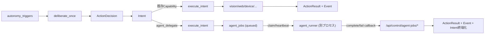

# 汎用エージェント委譲（agent_delegate）設計

<!-- Block: Scope -->
## 本書の位置づけ（実装前設計）

この文書は、`自発行動` から **汎用エージェント（Codexに限らない）** へ非同期委譲するための実装前設計です。  
本書の内容は設計固定を目的とし、**まだ実装は行わない**前提で記述します。

対象:

- CocoroGhost（Deliberation / Intent / 実行 / API / DB）
- CocoroConsole（監視UI / APIクライアント）
- 外部常駐の `agent_runner`（別プロセス）

非対象:

- 権限境界/権限制御（今回の前提では設けない）
- `side_effect_level` のような自己申告制御
- 実行時フォールバック（失敗時の自動代替処理）

<!-- Block: Decisions -->
## 前提と今回の設計決定（固定）

ユーザー方針として、以下を固定前提にする。

- `案4`（二段階選択）を採用する
  - Deliberation は「既存Capabilityで実行」か「汎用委譲（agent_delegate）」かを選ぶ
- `案2`（別プロセス実行）を採用する
  - 汎用委譲の実行本体は `agent_runner`（常駐・claim型）
- `Intent` は **agent job 完了まで完了させない**
- `agent_runner` は常駐して `claim` する方式にする
- 認証方式は実装時にどちらでもよい（本書では Phase 1 は既存Bearer流用を推奨）
- 指示本文（`task_instruction`）は自由文のまま扱う
- AI人格に権限境界を持たせない（権限判断の構造化はしない）
- `Codex` 固定にしないため、命名は `agent_runner` / `agent_job` を使う

<!-- Block: Why -->
## 目的（なぜ必要か）

既存Capability（`web_access`, `vision_perception` など）だけでは表現しにくい、自由度の高い行動を自発行動から実行できるようにする。

例:

- メール確認して、対応が必要なものだけ要点報告
- Web検索を含む複合調査
- SNS投稿の下書き作成（将来）
- コード調査/外部ツール実行（backend次第）

重要点:

- 主体はユーザーではなく **AI人格**
- Deliberation は「AI人格として今やるか」を決める
- 実行詳細（どのツールを使うか）は `agent_runner` に委譲する

<!-- Block: Architecture -->
## 全体アーキテクチャ（案4 + 案2）



役割分離:

- Deliberation: 人格判断（何をしたいか / 委譲するか）
- execute_intent: 実行開始（通常Capability or `agent_job` 発行）
- agent_runner: ツール選択と実行
- control API: Ghost と外部runnerの状態同期

<!-- Block: DeliberationIntegration -->
## Deliberation / Intent 統合設計

### 追加 action_type（新規）

- `action_type = "agent_delegate"`
- 対応 Capability 名: `agent_delegate`

Deliberation入力の `capabilities` に追加する想定:

```json
{
  "capability": "agent_delegate",
  "action_types": ["agent_delegate"],
  "backends": ["codex", "other_agent"]
}
```

補足:

- `backends` は「選べるbackend名の一覧」を Deliberation に知らせる用途
- backend名の意味（ツールセット等）は `agent_runner` 側の責務

### `agent_delegate` の ActionPayload（最小）

指示本文は構造化しない。最小限のルーティング情報だけ持つ。

```json
{
  "backend": "codex",
  "task_instruction": "メールをチェックして、対応が必要なものがあれば要点だけ報告して"
}
```

必須:

- `backend`（文字列）
- `task_instruction`（空でない文字列）

任意（Phase 2以降）:

- `backend_options`（backend側LLMに渡す補助情報）
- `task_context_hint`（自由文の補足）

### Intent 完了タイミング（固定）

- `agent_delegate` の Intent は **agent_job 完了/失敗まで終端化しない**
- `execute_intent` ジョブ自体は `agent_job` を作成した時点で完了してよい
- Intent 行は `running` のまま維持する

### 並列上限との整合（重要）

現行 `autonomy_max_parallel_intents` の claim は `status='running'` 件数を数える。  
`agent_delegate` を長時間 `running` にすると既存Capabilityが詰まりやすくなる。

実装設計（固定）:

- `execute_intent` claim時の並列数カウントから `action_type='agent_delegate'` を除外する
- `agent_delegate` は `running` のままでも、ローカルCapability枠を占有しない

理由:

- ユーザー決定（Intentは完了まで `running`）を維持する
- 既存Capabilityの進行を止めない

<!-- Block: GhostExecution -->
## CocoroGhost 実行フロー（実装時差し込み位置）

### 1. `deliberate_once`（既存）

変更点:

- `capabilities` カタログに `agent_delegate` を追加
- `backends` 一覧を Deliberation入力へ追加（または capability項目内へ持たせる）

主な変更対象:

- `cocoro_ghost/worker_handlers_autonomy.py` (`_collect_deliberation_input`)
- `cocoro_ghost/prompt_builders.py`（`agent_delegate` の出力例追記）

### 2. `execute_intent`（新規分岐）

`_handle_execute_intent()` に `agent_delegate` 分岐を追加する。

方針:

- 通常Capabilityのように `ActionResult` を即時保存しない
- `agent_jobs` に1件作成し、Intent は `running` 維持
- `agent_job` が callback 完了した時点で `ActionResult/Event` を保存する

差し込み位置（想定）:

- `cocoro_ghost/worker_handlers_autonomy.py` の action_type 分岐

### 3. callback での最終保存（新規）

`/api/control/agent-jobs/{job_id}/complete|fail` で以下を行う。

- `agent_jobs` の終端化（`completed` / `failed`）
- `action_result` event 作成（`source="action_result"`）
- `action_results` 作成
- `world_model_items` 集約（既存 `_upsert_world_model_item_from_action_result` を流用）
- 対応 Intent を `done` / `dropped` に遷移
- `promote_action_result_to_searchable` / `generate_write_plan` ジョブ投入

重要:

- `execute_intent` と callback の責務を二重化しない
- `agent_delegate` の `ActionResult` 正本は callback 側で作る

<!-- Block: DataModel -->
## Memory DB 設計（新規 `agent_jobs`）

### テーブル: `agent_jobs`

目的:

- 外部 `agent_runner` と Ghost の非同期状態同期
- 自発行動の委譲実行を Intent と追跡可能にする

推奨カラム（Phase 1 必須）

| カラム | 型 | 用途 |
|---|---|---|
| `job_id` | TEXT PK (UUID) | ジョブ識別子 |
| `intent_id` | TEXT FK | 対応Intent（1:1） |
| `decision_id` | TEXT FK | 対応ActionDecision（検索しやすさ用） |
| `backend` | TEXT | 委譲先backend識別子 |
| `task_instruction` | TEXT | AI人格が生成した自由文指示 |
| `status` | TEXT | `queued/claimed/running/completed/failed/cancelled/timed_out` |
| `claim_token` | TEXT NULL | claim/callback整合用 |
| `runner_id` | TEXT NULL | claimしたrunner識別子 |
| `attempts` | INTEGER | claim回数（基本1、復旧時に増える） |
| `heartbeat_at` | INTEGER NULL | 最終heartbeat（system UTC秒） |
| `result_status` | TEXT NULL | ActionResult相当（`success/partial/failed/no_effect`） |
| `result_summary_text` | TEXT NULL | 結果要約 |
| `result_details_json` | TEXT | 詳細JSON（既定 `{}`） |
| `error_code` | TEXT NULL | 失敗コード |
| `error_message` | TEXT NULL | 失敗メッセージ |
| `created_at` | INTEGER | system UTC秒 |
| `started_at` | INTEGER NULL | 実行開始時刻 |
| `finished_at` | INTEGER NULL | 終了時刻 |
| `updated_at` | INTEGER | system UTC秒 |

制約（Phase 1 推奨）

- `UNIQUE(intent_id)`（1 Intent から 1 agent_job）
- `CHECK status IN (...)`
- `CHECK status <> 'failed' OR length(trim(COALESCE(error_message,''))) > 0`
- `CHECK status IN ('queued') OR claim_token IS NOT NULL OR status IN ('completed','failed','cancelled','timed_out')`
- `CHECK result_status IS NULL OR result_status IN ('success','partial','failed','no_effect')`

インデックス（Phase 1 推奨）

- `idx_agent_jobs_status_created_at` (`status`, `created_at`)
- `idx_agent_jobs_backend_status` (`backend`, `status`)
- `idx_agent_jobs_heartbeat_at` (`heartbeat_at`)
- `idx_agent_jobs_intent_id` (`intent_id`)（`UNIQUE` で代替可）

### 監査ログテーブル（Phase 2 任意）

`agent_job_events`（append-only）を用意すると観測性が上がるが、Phase 1 は必須にしない。

理由:

- まずは `agent_jobs` 本体で状態遷移を成立させる方が実装を早く進められる
- `logs` と `agent_jobs` で初期運用は十分可能

### DBバージョン

- `memory DB` に新テーブル追加のため `PRAGMA user_version` を更新する
- 現在 `10` のため、実装時は `11` へ更新する想定

<!-- Block: APIControlPlane -->
## Ghost制御API（agent_runner連携用）

用途:

- `agent_runner` が job を claim/heartbeat/complete/fail するための制御面（control plane）
- CocoroConsole が状態観測するための監視面

実装先:

- `cocoro_ghost/api/control.py`（既存 `/api/control/*` に追加）
- `cocoro_ghost/schemas.py`（新規 request/response 型）

### `POST /api/control/agent-jobs/claim`

用途:

- 常駐 `agent_runner` が実行可能な job を1件以上取得する

リクエスト（例）:

```json
{
  "runner_id": "agent-runner-01",
  "backends": ["codex"],
  "limit": 1
}
```

レスポンス（例）:

```json
{
  "items": [
    {
      "job_id": "xxxxxxxx-xxxx-xxxx-xxxx-xxxxxxxxxxxx",
      "claim_token": "yyyyyyyy-yyyy-yyyy-yyyy-yyyyyyyyyyyy",
      "backend": "codex",
      "task_instruction": "メールをチェックして、対応が必要なものがあれば要点だけ報告して",
      "intent_id": "aaaaaaaa-aaaa-aaaa-aaaa-aaaaaaaaaaaa",
      "decision_id": "bbbbbbbb-bbbb-bbbb-bbbb-bbbbbbbbbbbb",
      "created_at": 1771819200
    }
  ]
}
```

claimルール:

- `status='queued'` のみ対象
- `backend` が `backends` に含まれるもののみ対象
- 原子的 `UPDATE ... WHERE status='queued'` で `claimed`
- `claim_token` を発行して返す

### `POST /api/control/agent-jobs/{job_id}/heartbeat`

用途:

- 長時間ジョブの生存通知

リクエスト（例）:

```json
{
  "runner_id": "agent-runner-01",
  "claim_token": "yyyyyyyy-yyyy-yyyy-yyyy-yyyyyyyyyyyy",
  "progress_text": "メール一覧を確認中"
}
```

動作:

- `status` を `running` に遷移（`claimed` -> `running`）
- `heartbeat_at` / `updated_at` 更新
- `progress_text` は初期はログ出力のみでもよい（DB保存は任意）

### `POST /api/control/agent-jobs/{job_id}/complete`

用途:

- 成功/部分成功/実質何もしない完了を返す

リクエスト（例）:

```json
{
  "runner_id": "agent-runner-01",
  "claim_token": "yyyyyyyy-yyyy-yyyy-yyyy-yyyyyyyyyyyy",
  "result_status": "success",
  "summary_text": "対応が必要なメールを2件検出しました。要点を報告します。",
  "details_json": {
    "items": [
      {"kind": "mail", "subject": "A", "reason": "返信期限が近い"},
      {"kind": "mail", "subject": "B", "reason": "未返信"}
    ]
  }
}
```

動作:

- `agent_jobs.status='completed'`
- `result_status/result_summary_text/result_details_json` 保存
- 対応Intentを `done`（`result_status != failed`）に遷移
- `ActionResult/Event/world_model_items` 保存 + 後続ジョブ投入

### `POST /api/control/agent-jobs/{job_id}/fail`

用途:

- runner 実行失敗を返す

リクエスト（例）:

```json
{
  "runner_id": "agent-runner-01",
  "claim_token": "yyyyyyyy-yyyy-yyyy-yyyy-yyyyyyyyyyyy",
  "error_code": "agent_execution_failed",
  "error_message": "メールAPI応答の解析に失敗しました"
}
```

動作:

- `agent_jobs.status='failed'`
- `error_code/error_message` 保存
- 対応Intentを `dropped`
- `ActionResult` は `result_status='failed'` で保存（summaryは error_message）

### `GET /api/control/agent-jobs`

用途:

- CocoroConsole/デバッグから一覧取得

クエリ（推奨）:

- `limit`（既定50）
- `status`（任意）
- `backend`（任意）

### `GET /api/control/agent-jobs/{job_id}`

用途:

- 1件詳細確認

### `POST /api/control/agent-jobs/{job_id}/cancel`（Phase 1 任意）

用途:

- queued/running job のキャンセル要求

設計方針:

- Phase 1 は省略可
- 実装する場合も「runnerへ伝達する要求フラグ」扱いに留める（強制停止はしない）

### 認証（Phase 1）

- 既存 Bearer 認証を流用（`/api/control/*` と同じ）
- 将来必要ならジョブ単位トークンへ拡張可能

<!-- Block: AgentRunner -->
## `agent_runner`（別プロセス）設計

### 役割

- `claim` した `agent_job` を実行する
- backend ごとのLLM/ツール統合を持つ
- Ghost へ `heartbeat` / `complete` / `fail` を返す

### backend と runner の関係

- `agent_runner` は1プロセスで複数backendに対応してもよい
- backend別に別プロセスを立ててもよい
- Ghost は `backend` 文字列で job をルーティングするだけ

### ツール選択（本設計の前提）

- 定義済みツール / 汎用ツールの選択は **runner 内の LLM** に任せる
- Ghost はツール選択や権限制御を行わない
- Ghost が持つのは `backend` と `task_instruction` と状態だけ

補足:

- `tool_catalog` を Ghost APIに乗せないことで、Ghost側設計をシンプルに保つ
- runner 側で `used_tools` を結果詳細へ返せば観測は可能

### 実行ループ（概念）

1. `claim(backends=[...])`
2. job取得
3. 実行開始時 `heartbeat`
4. 実行中 定期 `heartbeat`
5. `complete` または `fail`
6. 1へ戻る

### backend subprocess 契約（Phase 1 実装）

Phase 1 の `agent_runner` は、backend 実行を **固定コマンド + `task_instruction` 末尾引数** で扱う。

- runner -> backend subprocess（argv）
  - 例: `gemini.exe -p "<task_instruction>"`
  - `task_instruction` は常に最後の引数として付与する
- backend subprocess -> runner（stdout）
  - プレーンテキスト（成功時の結果本文）
- 失敗時
  - subprocess を非ゼロ終了し、`stderr` にエラーを書く（runner は `/fail` callback）

補足:

- Phase 1 は runner 内に `mock` backend を内蔵し、疎通確認ができるようにする
- `Codex` 固定ではなく、Ghost の `/api/settings` に保存した backend 実行コマンドを runner が参照する
- `backend="cli_agent"` は `global_settings.agent_backend_cli_agent_command` を使う
- backend stdout は Ghost にとって「内部結果」であり、そのまま Console 発話に素通ししない
  - Console 向けの人格発話（`autonomy.message`）は Ghost 側で再生成する方針とし、詳細は `docs/20_人格中心化（会話と自発行動）実装設計.md` を参照する

### runner 側の失敗方針

- 自動フォールバックしない
- runner が失敗したら `/fail` を返す
- Ghost は `failed` を保存し、次の Deliberation 材料にする

<!-- Block: StaleRecovery -->
## stale / 取り残し回復設計（必須）

`agent_runner` が異常終了すると、`agent_jobs` と `Intent` が取り残される。  
権限制御を持たない設計でも、**状態回復**は必要。

### 回復方針（固定）

- `heartbeat_at` が閾値を超えた `claimed/running` job を `timed_out` または `failed` 扱いにする
- 対応Intentを `dropped`
- `ActionResult(result_status='failed')` を保存する
- 自動再試行はしない

### 実装方式（推奨）

- 新規 worker job: `sweep_agent_jobs`
- Orchestrator が一定間隔で投入（または `snapshot_runtime` と同周期）

理由:

- 既存の `worker` に「失敗はスキップ」方針があるため整合が良い
- APIハンドラに回復責務を持たせない方が明確

<!-- Block: CocoroConsole -->
## CocoroConsole 実装前設計

### UI 方針（自発行動タブ）

既存の「機能グループ」方針に合わせて、監視/デバッグ領域へ `agent_jobs` を追加する。

表示案（Phase 1）:

- `汎用委譲ジョブ` 一覧（新しい順）
  - `status`
  - `backend`
  - `task_instruction`（先頭のみ）
  - `intent_id`
  - `created_at` / `updated_at`
  - `result_summary_text` / `error_message`

補足:

- 設定画面としては「有効/無効」や権限設定を持たない（今回の前提）
- 監視主体で開始し、操作は将来追加（再送/キャンセル等）

### APIクライアント（Phase 1）

`CocoroConsole/Services/CocoroGhostApiClient.cs` に追加するメソッド（想定）:

- `GetAgentJobsAsync(limit, status, backend)`
- `GetAgentJobAsync(jobId)`
- （任意）`CancelAgentJobAsync(jobId)`

対応DTO（新規）:

- `ControlAgentJobItem`
- `ControlAgentJobsResponse`
- `ControlAgentJobDetailResponse`

<!-- Block: ImplementationPlan -->
## 実装順（推奨）

### Phase 1（最小で成立）

1. `memory_models.py` に `agent_jobs` 追加
2. `db.py` で memory DB `user_version` 更新
3. `worker_handlers_autonomy.py` に `agent_delegate` 分岐追加（job作成まで）
4. `api/control.py` + `schemas.py` に `claim/heartbeat/complete/fail/list/get` 追加
5. callback で `ActionResult/Event/Intent終端化` 実装
6. `prompt_builders.py` / Deliberation入力に `agent_delegate` / `backends` を追加

### Phase 2（運用安定化）

1. `sweep_agent_jobs`（stale回復）
2. CocoroConsole の `agent_jobs` 監視UI
3. `/api/control/autonomy/status` に `agent_jobs` 集計を追加

### Phase 3（観測性向上）

1. `agent_job_events`（任意）
2. runner の `used_tools` / 実行統計の詳細保存

<!-- Block: FileMapping -->
## 実装時の主な変更ファイル（見積り）

### CocoroGhost

- `cocoro_ghost/memory_models.py`（`agent_jobs` 追加）
- `cocoro_ghost/db.py`（memory DB version更新）
- `cocoro_ghost/worker_handlers_autonomy.py`（`agent_delegate` 分岐 / callback最終化ヘルパ）
- `cocoro_ghost/prompt_builders.py`（Deliberation 出力例）
- `cocoro_ghost/api/control.py`（`/api/control/agent-jobs/*`）
- `cocoro_ghost/schemas.py`（control API schema）
- `cocoro_ghost/autonomy/repository.py` または新規 `autonomy/agent_job_repository.py`
- `cocoro_ghost/jobs/registry.py` / 新規 `worker_handlers_agent_jobs.py`（stale sweepを入れる場合）

### CocoroConsole

- `CocoroConsole/Services/CocoroGhostApiClient.cs`
- `CocoroConsole/Models/CocoroGhostApi/*.cs`（新規DTO）
- `CocoroConsole/Controls/AutonomySettingsControl.xaml(.cs)`（監視UI）

### ドキュメント

- `docs/07_API.md`（実装後に実APIとして追記）
- `docs/18_自発行動アーキテクチャ詳細設計.md`（Capabilityカタログ/制御APIの反映）

<!-- Block: Acceptance -->
## 実装受け入れ条件（設計時点）

- Deliberation が `action_type="agent_delegate"` を出せる
- `execute_intent` が `agent_jobs` を作成し、Intent を終端化せずに返せる
- `agent_runner` が `claim -> heartbeat -> complete` で job を完了できる
- 完了時に `ActionResult/Event` が保存され、既存の WritePlan/想起昇格フローに接続される
- runner停止時に `agent_jobs`/Intent の取り残しを回復できる（再試行なし）
- CocoroConsole から `agent_jobs` の状態が観測できる（Phase 2）

<!-- Block: OpenPoints -->
## 実装直前に最終確認する項目（少数）

1. `backend` 名の命名規約（`codex`, `foo_agent`, `local_agent` など）
2. callback認証を Phase 1 で既存Bearer流用にするか
3. `sweep_agent_jobs` の周期（例: 30秒）と stale 閾値（例: 120秒 or 300秒）

本書では 2 は「既存Bearer流用（Phase 1）」を推奨とする。
