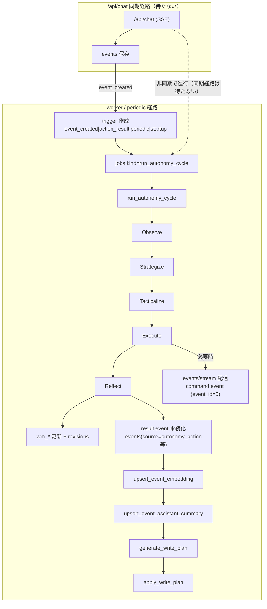
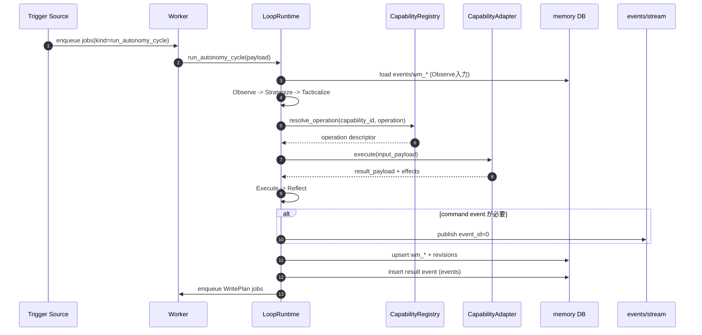

# 階層型世界モデル 基盤ループ

## 1. 文書の目的

本書は、階層型世界モデルの基盤ループ
（Observe / Strategize / Tacticalize / Execute / Reflect）を、
実装に直結する粒度で定義する仕様である。

## 2. スコープ

対象:

1. 5ループの入出力契約
2. `StrategicGoal` / `ActionTicket` / `ActionResult` 状態遷移
3. trigger / observation / reason_code 契約
4. worker/periodic での実行配置

非対象:

1. World Model テーブル詳細（`02_world_model.md`）
2. Capability Registry 詳細（`03_capability_registry.md`）
3. capability 個別仕様（`05_web_access.md`）

## 3. ランタイム配置

### 3.1 実行場所

1. ループ本体は `jobs.kind="run_autonomy_cycle"` として worker で実行
2. periodic はジョブ投入のみ行う（ループ本体を直接実行しない）
3. `/api/chat` 同期経路は変更しない

### 3.2 サイクル入口

```text
event 保存 / periodic tick / startup / action_result
    -> jobs(kind="run_autonomy_cycle", payload={trigger...}) を投入
    -> worker が run_autonomy_cycle(payload) を実行
```

### 3.3 実行頻度

1. event 起点: 永続 event 保存ごとに起動可
2. periodic 起点: デフォルト5秒周期で起動可（`periodic_interval_seconds` で変更可、1以上、重複起動禁止）
3. startup 起点: 起動時に1回
4. action_result 起点: action result 確定時に起動可
5. action_result 再起動: 同一 `result_id` 起点では1回まで（重複投入禁止）

### 3.4 全体フロー図



## 4. 基盤契約

`StrategicGoal` / `ActionTicket` / `ActionResult` の本体は
`docs/20_階層型世界モデル/00_概要.md` を正とする。

### 4.1 LoopTrigger

```json
{
  "trigger_type": "event_created|action_result|periodic|startup",
  "event_id": 123,
  "result_id": "uuid",
  "created_at": "2026-02-15T12:00:00"
}
```

ルール:

1. `event_created` では `event_id` 必須
2. `action_result` では `result_id` 必須
3. それ以外は付随ID省略可
4. `action_result` の同一 `result_id` は多重投入しない

### 4.2 ObservationRecord

```json
{
  "observation_id": "uuid",
  "source_type": "event|action_result|system",
  "source_ref": "event:123",
  "summary": "string",
  "payload_json": {},
  "importance": 0.0,
  "observed_at": "2026-02-15T12:00:00"
}
```

### 4.3 ReasonCode

状態遷移・失敗確定では `reason_code` を必須保存する。

1. `goal_precondition_missing`
2. `goal_success_criteria_met`
3. `goal_dropped_by_policy`
4. `ticket_precondition_failed`
5. `ticket_deadline_expired`
6. `execute_adapter_not_found`
7. `execute_schema_invalid`
8. `execute_runtime_error`
9. `reflect_replan_required`

## 5. ループ仕様

### 5.1 Observe

入力:

1. 新規永続 event（chat/notification/reminder/desktop_watch/vision_detail/meta_proactive/autonomy_action）
2. `ActionResult`
3. system trigger（periodic/startup）

処理:

1. trigger を `ObservationRecord` に正規化
2. 命令イベント（例: `vision.capture_request`）を除外
3. world model 更新要求（`world_model_update_request`）を生成

出力:

1. `observations[]`
2. `world_model_update_requests[]`

### 5.2 Strategize

入力:

1. `observations[]`
2. 現在の `StrategicGoal`（active/paused）

処理:

1. 目標生成/更新/停止
2. 優先度再計算
3. 状態更新（active/paused/done/dropped）

出力:

1. 更新済み `StrategicGoal[]`
2. `active_goal_ids[]`

規約:

1. 同一サイクルで同一 goal を複数回更新しない
2. 状態更新時は `reason_code` 必須

### 5.3 Tacticalize

入力:

1. `active_goal_ids[]`
2. capability 可用状態
3. 既存 `ActionTicket`（queued/running）

処理:

1. goal ごとに ticket 候補を生成
2. preconditions を評価
3. 実行可能 ticket を `queued` で確定

出力:

1. 新規 `ActionTicket[]`
2. `queued_ticket_ids[]`

規約:

1. 1 goal あたり同一サイクルで新規 ticket は最大1件
2. precondition 未成立 ticket は `cancelled` で確定（`ticket_precondition_failed`）
3. すべての ticket は共通 precondition `operation_available` を評価する
4. 既知 precondition 語彙（現行）は `operation_available` / `url_present` / `source_url_present` / `source_text_present`

#### Tacticalize 入力契約（IntentInputContract）

```json
{
  "trigger_type": "event_created|action_result|periodic|startup",
  "source_event": {
    "event_id": 123,
    "source": "user|autonomy_action|...",
    "user_text": "string",
    "assistant_text": "string"
  },
  "observation_text": "string"
}
```

ルール:

1. `source_event` は `trigger_type=event_created` でのみ必須
2. `observation_text` は Observe 層の出力をそのまま使用する
3. 意図解釈は `source_event.user_text` 優先、空なら `assistant_text` を使用する

#### Tacticalize 出力契約（TacticalPlanContract）

```json
{
  "goal_id": "string",
  "goal_title": "string",
  "goal_intent": "string",
  "success_criteria": ["string"],
  "capability_id": "string",
  "operation": "string",
  "input_payload": {},
  "preconditions": ["string"],
  "expected_effect": ["string"],
  "verify": ["string"]
}
```

ルール:

1. `capability_id + operation` は registry で解決可能な組のみを出力する
2. `input_payload` は対象 operation の input schema と一致させる
3. `preconditions` は `cocoro_ghost/autonomy/preconditions.py` で評価可能な語彙のみを許可する
4. 同一入力に対して同一計画を返す（ランダム分岐を持ち込まない）

### 5.4 Execute

入力:

1. `queued_ticket_ids[]`
2. capability registry / adapter

処理:

1. ticket を `running` へ遷移
2. adapter 解決（`capability_id + operation`）
3. input schema 検証
4. adapter を1回実行
5. result/effect schema 検証
6. `ActionResult` 確定、ticket を `succeeded|failed` に更新

出力:

1. `ActionResult[]`

規約:

1. adapter 未解決は即 `failed`（`execute_adapter_not_found`）
2. schema 不一致は即 `failed`（`execute_schema_invalid`）
3. runtime 失敗は即 `failed`（`execute_runtime_error`）
4. fallback/retry を内部実装しない

### 5.5 Reflect

入力:

1. `ActionResult[]`
2. 関連 `StrategicGoal` / `ActionTicket`

処理:

1. `expected_effect` と実結果差分評価
2. goal/ticket 状態更新
3. 再計画要否の判定

出力:

1. goal/ticket 更新差分
2. 次サイクル起動要否

規約:

1. failed 結果を必ず反省処理へ通す
2. 反省結果は次サイクルで利用できる形式で保存する

### 5.6 1サイクルのシーケンス図



## 6. 状態遷移

### 6.1 StrategicGoal

1. `active -> paused`（`goal_precondition_missing`）
2. `active -> done`（`goal_success_criteria_met`）
3. `active -> dropped`（`goal_dropped_by_policy`）
4. `paused -> active`（再開条件成立）

### 6.2 ActionTicket

1. `queued -> running`（実行開始）
2. `running -> succeeded`（実行成功）
3. `running -> failed`（adapter/schema/runtime 失敗）
4. `queued -> cancelled`（precondition 未成立または上位 goal 停止）
5. `queued -> expired`（deadline 超過）

## 7. 観測項目（最低限）

1. `run_autonomy_cycle` 実行回数（trigger_type 別）
2. goal 状態遷移件数（状態別）
3. ticket 状態遷移件数（状態別）
4. ループ別処理時間（Observe/Strategize/Tacticalize/Execute/Reflect）
5. 実行失敗件数（reason_code 別）
